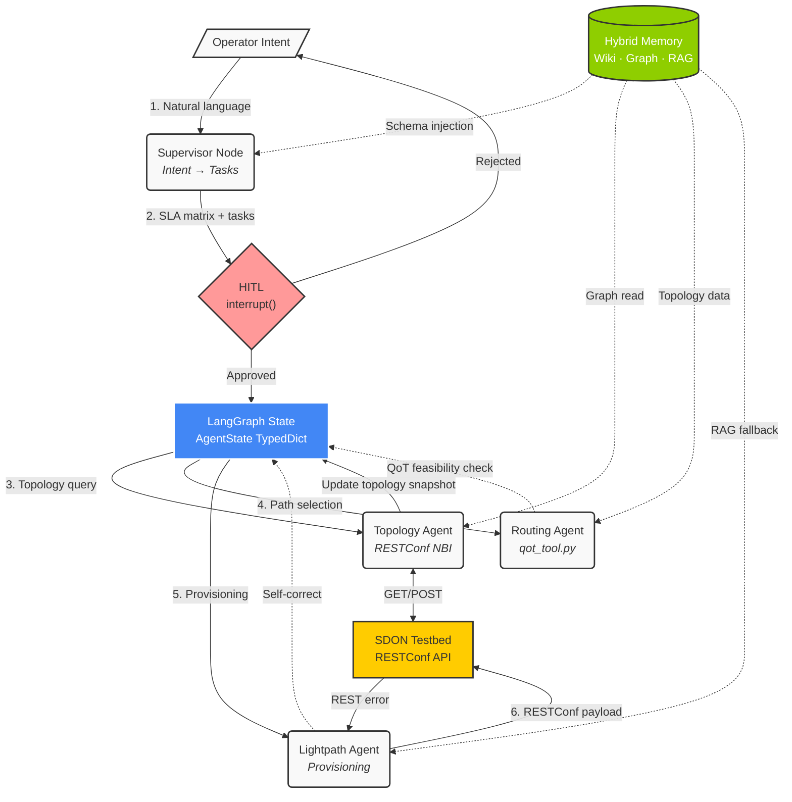

# Architecture V2: MultiAgentON Unified System Design

## 1. Executive Summary

This document consolidates the full system architecture for the MultiAgentON project — an **Intent-Based Multi-Agent Orchestrator** for Software-Defined Optical Networks (SDON). It unifies:

- The **Sequential Multi-Agent Workflow** (V2 LangGraph topology)
- The **Tri-Partite Hybrid Memory Architecture** (Wiki + Graph + RAG)
- The **ECOC 2024 Baseline Bridge** (reusing pipeline logic and RESTConf schemas)
- The **QoT Physics Port Strategy** (Python GN model for path feasibility)

The system is designed as a **"Slow Loop" Semantic Orchestrator** that translates human intent into structured network configurations, delegates to specialized agents, and pushes validated payloads to the SDN Controller via RESTConf.

---

## 2. System Overview

### 2.1 Design Principles

1. **LLMs reason, tools calculate.** The LLM acts as a reasoning engine for intent parsing and task delegation. All physical-layer math (SNR, power) and network I/O (RESTConf) are handled by deterministic Python tools. No hallucination allowed for numerical outputs.
2. **Sequential coordination, not simultaneous optimization.** The Supervisor decomposes complex intents into ordered sub-tasks and delegates them one at a time. This avoids the combinatorial explosion of joint optimization.
3. **Human-in-the-Loop by default.** Before any network-modifying action, the system pauses for operator approval using LangGraph's native `interrupt()` mechanism.
4. **Memory outside the context window.** The Hybrid Memory substrate keeps structured knowledge (topology, SLA history, rules) outside the LLM's token budget, queried on demand.

### 2.2 Architecture Diagram



---

## 3. Memory Substrate: Tri-Partite Hybrid Architecture

The orchestrator manages knowledge through three complementary memory modalities, inspired by human cognitive science (procedural, semantic, and episodic memory). This design prevents context window explosion while maintaining precise state tracking.

### 3.1 Pillar 1 — Hierarchical Wikis (Procedural Memory)

- **Technology**: File-based Markdown with YAML frontmatter (this `LLM_Wiki`).
- **Role**: Stores absolute ground-truths — agent personas, skill instructions, architectural rules, and standard operating procedures.
- **Usage**: Deterministic and file-based, guaranteeing agents load exact, unhallucinated instructions at boot time.
- **Reference**: [[Tool_Registry]], agent skill files in `.agents/skills/`.

### 3.2 Pillar 2 — Knowledge Graph / State Tracker (Semantic Memory)

- **Technology (MVP)**: Typed Python data structures (Pydantic models) within the LangGraph `AgentState`. Future: technology-agnostic Graph Database.
- **Role**: Topological and state management — explicitly maps network relationships and agent dependencies.
- **Usage**: Tracks the live state of the testbed (nodes, links, active services, OA positions), maps which sub-agent handles which SLA constraint, and enables deterministic multi-hop reasoning (e.g., tracing an optical path through network layers).
- **MVP Note**: For the initial implementation, the topology and state are stored as Pydantic models inside `AgentState`, avoiding external database infrastructure until multi-hop queries become a validated requirement.

### 3.3 Pillar 3 — Vector RAG (Episodic Memory)

- **Technology**: Semantic Embeddings / Vector Databases.
- **Role**: Episodic recall and unstructured search.
- **Usage**: Activated when an agent encounters unexpected errors or needs historical context. Searches through past error logs, telecom documentation, and historical resolutions.
- **MVP Note**: Deferred. Not required for the Topology Query experiment.

### 3.4 Memory Usage by Phase

| Phase | Wiki (P1) | Graph/State (P2) | RAG (P3) |
|-------|-----------|-------------------|----------|
| Boot / Initialization | ✅ Load rules, schemas | — | — |
| Intent Parsing | ✅ SLA templates | ✅ Past SLA matrices | — |
| Agent Execution | ✅ Skill injection | ✅ Read/write topology | — |
| Conflict Resolution | — | ✅ Constraint check | ✅ Error lookup |

---

## 4. Workflow Phases

### Phase 0: Initialization & Schema Loading

Before processing any intent, the system loads deterministic context:
1. Agent skill files from the Wiki (Pillar 1) are injected into each agent's system prompt.
2. RESTConf JSON schemas from the ECOC baseline (`lightpath_schema.json`, `service_schema.json`, `measurement_schema.json`, `task_schema.json`) are available as Pydantic models for structured output validation.
3. The Topology Agent may pre-fetch the current testbed state if a cached topology exists.

### Phase 1: Intent Parsing & Translation (Supervisor Node)

The **Supervisor Node** replaces the ECOC baseline's `planning.py` with an LLM-driven intent parser:

1. **Input**: A network operator enters a natural language command (e.g., *"Provide a highly reliable, low-latency network slice to stream 4K VR data from the central database to an edge node for rendering"*).
2. **Context Retrieval**: The Supervisor queries the Memory Substrate for established SLA templates and topological constraints.
3. **LLM Translation**: The LLM parses the intent, translating abstract concepts into numerical [[Concepts_and_Terminology|SLA]] constraints (e.g., `< 10ms` latency, `5 Gbps` bandwidth). It produces:
   - A structured **SLA matrix** (Pydantic model)
   - A **task list** (ordered sequence of delegations)
4. **Structured Output**: Uses `model.with_structured_output(TaskPlan)` to guarantee the LLM produces valid Pydantic objects, not free-form text.

### Phase 2: Human-in-the-Loop (HITL) Validation

To prevent **Garbage In, Garbage Out (GIGO)**, the graph pauses for operator approval before executing any network-modifying actions.

**Implementation (LangGraph `interrupt()`):**

```python
from langgraph.types import interrupt, Command

def hitl_node(state: AgentState) -> Command[Literal["execute", "revise"]]:
    decision = interrupt({
        "question": "Approve this execution plan?",
        "sla_matrix": state["sla_matrix"],
        "task_list": state["task_list"],
    })
    if decision["approved"]:
        return Command(goto="execute")
    else:
        return Command(goto="revise", update={"feedback": decision["feedback"]})
```

> **LangGraph Validation Note**: The previous architecture used a manual `is_authorized` state flag. Modern LangGraph provides the `interrupt()` primitive that natively pauses graph execution and integrates with checkpointers for durability. The `Command(resume=...)` pattern is the correct way to implement HITL.

**When HITL triggers:**
- **Always** for write operations (lightpath provisioning, service creation, measurement start).
- **Never** for read-only operations (topology queries, status checks).

### Phase 3: Multi-Agent Delegation (Replaces `execution.py`)

The Supervisor delegates tasks to specialized agent nodes. Each agent is implemented as a **regular LangGraph node function** (not a subgraph) that receives the shared `AgentState` and may call deterministic tools.

> **LangGraph Validation Note**: Subgraphs (separate `StateGraph` instances with their own state schemas) add communication overhead and state synchronization complexity. For the MVP, agents are plain node functions. Graduate to subgraphs when agent logic becomes sufficiently complex to warrant isolated state.

#### 3.1 Topology Agent

- **Purpose**: Queries the SDON testbed via RESTConf NBI to extract physical topology data (nodes, fiber spans, OA locations, active channels).
- **Tool**: `fetch_topology` — wraps the `TestbedClient` interface.
- **Output**: Updates `AgentState.topology_snapshot` with a typed Pydantic model representing the current network state.
- **Data Flow**: Testbed → RESTConf JSON → Pydantic model → AgentState → available to all downstream agents.

#### 3.2 Routing Agent

- **Purpose**: Selects optimal paths through the network, validated by the QoT Physics Tool.
- **Tool**: `qot_tool` — pure Python port of the GN model from `Network.cpp` (see [[tools_wiki/QoT_Tool]]).
- **Input**: Candidate path (list of node names), channel ID.
- **Output**: `{snr_db: float, receiver_power_dbm: float, feasible: bool}`.
- **Key Design**: The Routing Agent does NOT call the C++ simulator. It calls a pure Python function that executes the GN model math in-memory, reading physical parameters from the topology snapshot in the state.

#### 3.3 Lightpath & Provisioning Agent

- **Purpose**: Generates valid RESTConf JSON payloads using the ECOC baseline schemas to establish connections.
- **Tool**: `provision_lightpath` — builds and sends POST requests to the controller NBI.
- **Structured Output**: Uses `model.with_structured_output(LightpathPayload)` to guarantee valid JSON aligned with `lightpath_schema.json`.

### Phase 4: Conflict Resolution & Fast Loop

- **Conditional Edges**: If the testbed returns a REST error (e.g., "ID already taken") or the QoT tool flags an infeasible path (`feasible: False`), a conditional edge routes back to the responsible agent.
- **Error Context**: The failing agent receives specific physical bottlenecks (e.g., `"Span 3 SNR degraded below 12dB"`) to guide self-correction.
- **RAG Fallback**: If standard correction fails, the agent queries Vector RAG (Pillar 3) for historical workarounds.
- **Final Execution**: Once all constraints are resolved, the Supervisor pushes the valid API payload to the SDN Controller.

---

## 5. QoT Integration Strategy

### 5.1 Approach: Pure Python Physics Port

We port the core Gaussian Noise (GN) model equations from the C++ simulator (`Network.cpp`) into a native Python tool (`qot_tool.py`). This approach was selected over:

- **Rejected — Subprocess Wrapper**: Spawning the full GA solver binary for single-path evaluation is a massive latency anti-pattern.
- **Rejected — C++ Shared Library**: The tightly coupled OOP structure of the C++ code makes `pybind11` bindings impractical without significant refactoring.

### 5.2 Target Functions

From `Network.cpp`:
- `calculateDemandSNR` → Python `calculate_demand_snr()`
- `calculatePropagatedSNR` → Python `calculate_propagated_snr()`
- `spanSNR` → Python `span_snr()`

### 5.3 Tool Schema

```python
@tool
def qot_check(service_id: str, route_nodes: list[str], channel_id: int) -> dict:
    """Evaluate QoT feasibility for a proposed optical path."""
    return {
        "snr_db": 18.5,           # Final Signal-to-Noise ratio
        "receiver_power_dbm": -12.3,  # Power at destination
        "feasible": True,         # snr > threshold AND power > -18 dBm
    }
```

### 5.4 Data Source

The QoT tool reads physical parameters (fiber lengths, attenuation coefficients, OA gains) from `AgentState.topology_snapshot`, which is populated by the Topology Agent from the live testbed. This eliminates static `.dat` files entirely.

### 5.5 Open Questions (for Professor)

1. **Hardware Constants**: Are `filter_loss_dB = 6`, `connector_loss_dB`, `att_coeff_dB_km` static for the testbed hardware, or must they be queried dynamically?
2. **Gold Standard**: Can we get a RESTConf JSON dump of an active verified service + measured SNR for unit test validation?

---

## 6. ECOC 2024 Baseline Bridge

### What We Reuse

| Baseline Asset | Our Usage |
|---|---|
| `planning.py` pipeline logic | Mapped to Supervisor Node (intent → task list) |
| `execution.py` loop | Mapped to agent delegation cycle |
| `lightpath_schema.json` | Pydantic model for `with_structured_output()` |
| `service_schema.json` | Pydantic model for service provisioning |
| `measurement_schema.json` | Pydantic model for monitoring commands |
| `task_schema.json` | Pydantic model for task decomposition |
| RESTConf NBI interface | Direct reuse for all testbed communication |

### What We Replace

| Baseline Limitation | Our Solution |
|---|---|
| Stateless linear script | LangGraph `StateGraph` with persistent state |
| No memory across turns | Tri-Partite Hybrid Memory |
| Hardcoded local `mixtral` GGUF | Provider-agnostic LLM via LangChain |
| No validation before execution | HITL via `interrupt()` + QoT pre-check |
| No error recovery | Conditional edges + RAG fallback |

---

## 7. LangGraph Implementation Details

### 7.1 State Schema

```python
from typing import Annotated, TypedDict
import operator

class AgentState(TypedDict):
    # Communication channel (append-only via reducer)
    messages: Annotated[list, operator.add]

    # Phase 1 outputs
    sla_matrix: dict | None          # Parsed SLA constraints
    task_list: list[dict] | None     # Ordered delegation plan

    # Phase 3 outputs
    topology_snapshot: dict | None   # Current testbed state
    feasibility_result: dict | None  # QoT check output
    provisioning_payload: dict | None  # Final RESTConf JSON

    # Control flow
    current_agent: str | None        # Active agent name
    error_context: str | None        # Error details for retry loops
```

> **LangGraph Validation Note**: The `messages` field uses `Annotated[list, operator.add]` as a reducer to support append-only semantics. Domain-specific fields (`sla_matrix`, `topology_snapshot`) are plain typed fields that get overwritten on each update.

### 7.2 Graph Topology

```python
from langgraph.graph import StateGraph, START, END

builder = StateGraph(AgentState)

# Nodes
builder.add_node("supervisor", supervisor_node)
builder.add_node("hitl", hitl_node)
builder.add_node("topology_agent", topology_node)
builder.add_node("routing_agent", routing_node)
builder.add_node("lightpath_agent", lightpath_node)

# Edges
builder.add_edge(START, "supervisor")
builder.add_conditional_edges("supervisor", route_by_task)
builder.add_edge("topology_agent", "supervisor")
builder.add_edge("routing_agent", "supervisor")
builder.add_edge("lightpath_agent", "supervisor")

graph = builder.compile(checkpointer=checkpointer)
```

### 7.3 Supervisor as Central Router

The Supervisor acts as a **hub node** that all agents return to. After each agent completes, the Supervisor inspects the updated state and decides the next step via `route_by_task()`. This pattern (hub-and-spoke) is the recommended LangGraph approach for multi-agent coordination without subgraphs.

---

## 8. Technology Stack

| Component | Technology | Package |
|---|---|---|
| Orchestration framework | LangGraph | `langgraph` |
| LLM abstraction | LangChain Core | `langchain-core` |
| LLM provider | Kimi (Anthropic-compatible) | `langchain-anthropic` |
| Data validation | Pydantic v2 | `pydantic` |
| Testbed communication | RESTConf / HTTP | `httpx` |
| State persistence | LangGraph Checkpointer | `langgraph` (built-in) |
| Tracing (optional) | LangSmith | `langsmith` |
| Testing | pytest + Strict TDD | `pytest`, `pytest-mock` |

---

## 9. Implementation Roadmap

### Experiment 001: Topology Query MVP (Current Focus)
Operator asks about topology → Supervisor parses → Topology Agent queries mock → State updated → Response returned. See [[experiments/Experiment_001_Topology_Query_MVP]].

### Experiment 002: Routing + QoT Validation (Next)
Operator requests a lightpath → Routing Agent proposes path → QoT tool validates feasibility → Self-correction loop if infeasible.

### Experiment 003: Full Provisioning Loop (Future)
End-to-end: intent → HITL approval → topology check → routing + QoT → lightpath provisioning → error handling → confirmation.

### Experiment 004: Real Testbed Integration (Requires SSH/VPN)
Replace `MockTestbedClient` with `RESTConfTestbedClient` connected to the actual SDON controller NBI.

---

## 10. Cross-References

- [[Tool_Registry]] — Registry of deterministic tools
- [[tools_wiki/QoT_Tool]] — QoT C++ simulator documentation
- [[Concepts_and_Terminology]] — Glossary of terms
- [[ProblemStatement_20260427_Felipe_Abadia]] — Thesis problem definition
