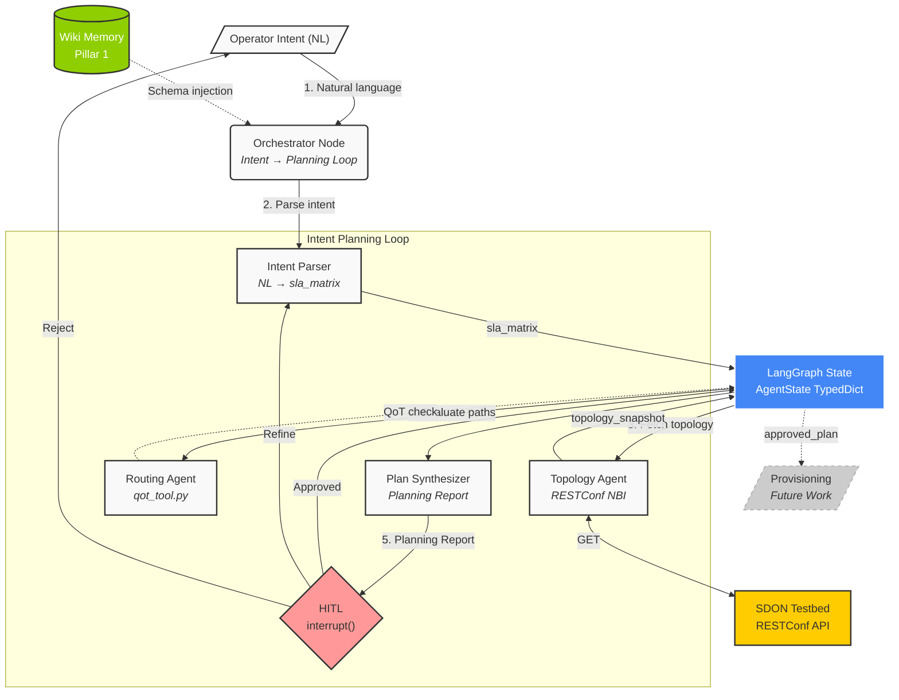

# Architecture V3: QoT-Informed Intent Planning System

## 1. Executive Summary

This document defines the system architecture for a **QoT-Informed Intent Planning System** for Software-Defined Optical Networks (SDON). The system implements an **Intent Planning Loop** — an iterative, multi-agent workflow that translates unstructured operator intent into a validated optical routing plan, informed by deterministic physical-layer simulation and refined through multi-turn Human-in-the-Loop (HITL) interaction.

The architecture focuses exclusively on the **planning phase** of network operations. It does not provision lightpaths or execute network-modifying actions. Instead, it produces a structured **Planning Report** — a validated artifact containing QoT-feasible candidate paths, trade-off analysis, and operator-approved routing decisions — that downstream provisioning systems could consume.

**Scope pivot rationale:** See [[Scope_Pivot_20260621]] for the SOTA evidence motivating this focused scope.

### Why Planning, Not Full Lifecycle

The SOTA analysis ([[lit_comparison]], [[sota_gap_analysis]]) revealed that full multi-agent lifecycle management for optical networks is already demonstrated by AutoLight (SJTU, ECOC 2025) and that hyperscale multi-agent orchestration is production-proven by Confucius (Meta, SIGCOMM 2025). However, **no existing work** combines:
1. Natural language intent parsing with formal reverse prompting
2. QoT-aware path evaluation via neurosymbolic GN model delegation
3. Multi-turn HITL refinement as an architectural primitive

All three capabilities converge in the planning phase, making it the optimal focus for a novel thesis contribution.

---

## 2. Design Principles

1. **LLMs reason, tools calculate.** The LLM acts as a reasoning engine for intent parsing, synthesis, and operator interaction. All physical-layer math (SNR, power) and network I/O (RESTConf) are handled by deterministic Python tools. No hallucination allowed for numerical outputs.
2. **Planning produces artifacts, not side effects.** The system's output is a validated Planning Report — a structured data object — not a network configuration change. This separation enables safe iteration without risk to the physical network.
3. **Multi-turn HITL by design.** The planning loop is inherently conversational. The operator and the system co-construct the routing plan through iterative refinement, not a single approve/reject checkpoint.
4. **Sequential coordination, not simultaneous optimization.** The Orchestrator decomposes planning into ordered sub-tasks and delegates them one at a time to specialized agents.

---

## 3. System Overview

### 3.1 Architecture Diagram



---

## 4. Memory Substrate (Simplified)

The planning system uses two memory modalities, simplified from the V2 Tri-Partite design to match the planning-focused scope.

### 4.1 Pillar 1 — Wiki Memory (Procedural)

- **Technology**: File-based Markdown with YAML frontmatter (this `LLM_Wiki`).
- **Role**: Stores deterministic ground-truths — agent skill instructions, RESTConf schemas, architectural rules.
- **Usage**: Loaded at boot time. Guarantees agents receive exact, unhallucinated instructions.
- **Reference**: [[Tool_Registry]], agent skill files in `.agents/skills/`.

### 4.2 Pillar 2 — Pydantic State (Semantic, MVP)

- **Technology**: Typed Python data structures (Pydantic models) within the LangGraph `AgentState`.
- **Role**: Manages the live planning context — topology snapshot, SLA matrix, candidate paths, QoT results, planning report.
- **Usage**: Tracks the current state of the planning loop. All agents read from and write to this shared state.
- **Future graduation**: If multi-hop topological reasoning becomes a validated requirement, graduate to a graph database (Neo4j/Memgraph).

### 4.3 Deferred — Vector RAG (Pillar 3)

Deferred to future work. Not required for the planning loop MVP. Would be relevant for error recovery (searching historical resolutions) or operational Day-N tasks.

---

## 5. Intent Planning Loop Workflow

### Phase 0: Initialization & Schema Loading

Before processing any intent, the system loads deterministic context:
1. Agent skill files from the Wiki (Pillar 1) are injected into each agent's system prompt.
2. RESTConf JSON schemas from the ECOC baseline (`lightpath_schema.json`, `service_schema.json`) are available as Pydantic models for structured output validation.
3. The Topology Agent may pre-fetch the current testbed state if a cached topology exists.

### Phase 1: Intent Parsing & Translation

The **Orchestrator** parses the operator's natural language intent:

1. **Input**: A network operator enters a natural language command (e.g., *"Provide a highly reliable, low-latency network slice to stream 4K VR data from the central database to an edge node for rendering"*).
2. **Context Retrieval**: The Orchestrator queries the Wiki for established SLA templates and schema definitions.
3. **LLM Translation**: The LLM parses the intent, translating abstract concepts into numerical [[Concepts_and_Terminology|SLA]] constraints (e.g., `< 10ms` latency, `5 Gbps` bandwidth). It produces:
   - A structured **SLA matrix** (Pydantic model)
   - Initial endpoint and constraint identification
4. **Structured Output**: Uses `json_mode` response format combined with manual `SLAMatrix.model_validate_json()` parsing to guarantee valid Pydantic objects.

### Phase 2: QoT-Informed Planning Loop (Core Contribution)

This is the central workflow of the system — an iterative loop where the Orchestrator coordinates topology retrieval, path evaluation, and operator refinement.

#### Step 2a: Topology Acquisition

The Orchestrator delegates to the **Topology Agent**:
- **Purpose**: Queries the SDON testbed via RESTConf NBI to extract physical topology data.
- **Tool**: `fetch_topology` — wraps the `TestbedClient` interface.
- **Output**: Updates `AgentState.topology_snapshot` with a typed Pydantic model representing the current network state (nodes, fiber spans, OA positions, active channels).

#### Step 2b: QoT-Informed Path Evaluation

The Orchestrator delegates to the **Routing Agent**:
- **Purpose**: Identifies candidate paths through $G(V,E)$ that satisfy the SLA constraints, and evaluates each using the QoT Physics Tool.
- **Tool**: `qot_check` — pure Python port of the GN model from `Network.cpp`.
- **Input**: Candidate path (list of node names), channel ID.
- **Output per path**: `{snr_db: float, receiver_power_dbm: float, feasible: bool}`.
- **Key Design**: The Routing Agent does NOT call the C++ simulator. It calls a pure Python function that executes the GN model math in-memory, reading physical parameters from `topology_snapshot`.

```python
@tool
def qot_check(service_id: str, route_nodes: list[str], channel_id: int) -> dict:
    """Evaluate QoT feasibility for a proposed optical path."""
    return {
        "snr_db": 18.5,
        "receiver_power_dbm": -12.3,
        "feasible": True,
    }
```

#### Step 2c: Planning Report Synthesis

The Orchestrator synthesizes a **Planning Report** from the topology and QoT results:

```python
class PlanningReport(BaseModel):
    """Structured output of the Intent Planning Loop."""
    intent_summary: str                    # Parsed operator intent
    sla_matrix: SLAMatrix                  # Validated SLA constraints
    candidate_paths: list[CandidatePath]   # Paths with QoT scores
    recommendation: str                    # Orchestrator's recommendation
    trade_off_analysis: str                # Comparison of viable options
    iteration: int                         # Current HITL iteration number
```

```python
class CandidatePath(BaseModel):
    """A single candidate path with QoT evaluation."""
    route_nodes: list[str]       # Ordered list of node names
    snr_db: float                # Signal-to-Noise Ratio
    receiver_power_dbm: float    # Power at destination
    feasible: bool               # Meets QoT thresholds
    sla_violations: list[str]    # Which SLA constraints are violated, if any
```

#### Step 2d: Multi-Turn HITL Refinement

The Orchestrator presents the Planning Report to the operator via `interrupt()`:

```python
from langgraph.types import interrupt, Command

def hitl_planning_node(state: AgentState) -> Command[Literal["refine", "finalize"]]:
    decision = interrupt({
        "question": "Review the Planning Report. Approve, refine, or reject?",
        "planning_report": state["planning_report"],
    })
    if decision["action"] == "approve":
        return Command(goto="finalize", update={
            "approved_plan": state["planning_report"],
            "hitl_history": state["hitl_history"] + [decision],
        })
    elif decision["action"] == "refine":
        return Command(goto="parse_intent", update={
            "operator_feedback": decision["feedback"],
            "hitl_history": state["hitl_history"] + [decision],
        })
    else:  # reject
        return Command(goto="parse_intent", update={
            "sla_matrix": None,
            "operator_feedback": decision["feedback"],
            "hitl_history": state["hitl_history"] + [decision],
        })
```

The loop continues until the operator approves or the iteration bound $N_{max}$ is reached.

### Phase 3: Provisioning (FUTURE WORK)

> **Not implemented in the current scope.** Once the planning loop produces an `approved_plan`, a downstream Lightpath Agent could generate valid RESTConf JSON payloads using the ECOC baseline schemas to establish connections. This is documented as future work. See [[Scope_Pivot_20260621]].

---

## 6. LangGraph Implementation Details

### 6.1 State Schema

```python
from typing import Annotated, TypedDict
import operator

class AgentState(TypedDict):
    # Communication channel (append-only via reducer)
    messages: Annotated[list, operator.add]

    # Phase 1 outputs
    sla_matrix: dict | None          # Parsed SLA constraints
    operator_feedback: str | None    # Latest operator refinement

    # Phase 2 outputs
    topology_snapshot: dict | None   # Current testbed state
    candidate_paths: list[dict] | None  # Paths with QoT results
    planning_report: dict | None     # Synthesized Planning Report

    # Planning Loop state
    approved_plan: dict | None       # Final approved plan (loop exit)
    hitl_history: list[dict]         # Refinement conversation trace
    iteration: int                   # Current HITL iteration

    # Control flow
    current_agent: str | None        # Active agent name
    error_context: str | None        # Error details for retry
```

### 6.2 Graph Topology

```python
from langgraph.graph import StateGraph, START, END

builder = StateGraph(AgentState)

# Nodes
builder.add_node("orchestrator", orchestrator_node)
builder.add_node("parse_intent", parse_intent_node)
builder.add_node("topology_agent", topology_node)
builder.add_node("routing_agent", routing_node)
builder.add_node("synthesize_plan", synthesize_plan_node)
builder.add_node("hitl_planning", hitl_planning_node)
builder.add_node("finalize", finalize_node)

# Edges — Intent Planning Loop
builder.add_edge(START, "orchestrator")
builder.add_edge("orchestrator", "parse_intent")
builder.add_edge("parse_intent", "topology_agent")
builder.add_edge("topology_agent", "routing_agent")
builder.add_edge("routing_agent", "synthesize_plan")
builder.add_edge("synthesize_plan", "hitl_planning")

# HITL conditional edges
builder.add_conditional_edges("hitl_planning", route_hitl_decision)
builder.add_edge("finalize", END)

graph = builder.compile(checkpointer=checkpointer)
```

### 6.3 Orchestrator as Planning Coordinator

The Orchestrator acts as the entry point and context manager for the planning loop. Unlike V2's hub-and-spoke pattern where agents return to the supervisor after every action, V3 uses a **linear pipeline with a HITL feedback loop** — the planning phases execute sequentially, and only the HITL node can route back to earlier phases.

This pattern is simpler, more predictable, and directly maps to the planning loop concept.

---

## 7. ECOC 2024 Baseline Bridge

### What We Reuse

| Baseline Asset | Our Usage |
|---|---|
| `planning.py` pipeline logic | Mapped to Intent Parser (NL → SLA matrix) |
| `lightpath_schema.json` | Pydantic model for Planning Report path descriptions |
| `service_schema.json` | Pydantic model for SLA constraint validation |
| RESTConf NBI interface | Direct reuse for Topology Agent testbed communication |

### What We Replace

| Baseline Limitation | Our Solution |
|---|---|
| Stateless linear script | LangGraph `StateGraph` with persistent state and HITL loop |
| No memory across turns | Wiki Memory (Pillar 1) + Pydantic State (Pillar 2) |
| Hardcoded local `mixtral` GGUF | Provider-agnostic LLM via LangChain |
| No validation before execution | Multi-turn HITL via `interrupt()` + QoT pre-check |
| Single-pass output | Iterative Planning Report refinement |

---

## 8. Technology Stack

| Component | Technology | Package |
|---|---|---|
| Orchestration framework | LangGraph | `langgraph` |
| LLM abstraction | LangChain Core | `langchain-core` |
| LLM provider | Kimi (OpenAI-compatible) | `langchain-openai` |
| Data validation | Pydantic v2 | `pydantic` |
| Testbed communication | RESTConf / HTTP | `httpx` |
| State persistence | LangGraph Checkpointer | `langgraph` (built-in) |
| Tracing (optional) | LangSmith | `langsmith` |
| Testing | pytest + Strict TDD | `pytest`, `pytest-mock` |

---

## 9. Experiment Roadmap

### Experiment 001: Topology Query MVP ✅
Operator asks about topology → Orchestrator parses → Topology Agent queries mock → State updated → Response returned. Successfully validated with live Kimi API. See [[experiments/Experiment_001_Topology_Query_MVP]].

### Experiment 002: Intent Parsing + HITL Reverse Prompting
Operator expresses a complex NL intent → Orchestrator parses to `sla_matrix` → HITL `interrupt()` presents parsed intent → Operator refines → Loop until approved. Validates Phase 1 and the HITL mechanism in isolation.

### Experiment 003: QoT-Informed Path Selection
Given a topology snapshot and SLA constraints → Routing Agent identifies candidate paths → QoT tool evaluates each → Planning Report generated. Validates Phase 2 (steps 2b–2c) with mock topology.

### Experiment 004: Full Intent Planning Loop
End-to-end integration: NL intent → parse → topology fetch → QoT path evaluation → Planning Report → HITL refinement → approved plan. Validates the complete planning loop as defined in this architecture.

---

## 10. Cross-References

- [[Scope_Pivot_20260621]] — Rationale for the planning-focused scope
- [[ProblemStatement_v3]] — Thesis problem definition
- [[Tool_Registry]] — Registry of deterministic tools
- [[tools_wiki/QoT_Tool]] — QoT C++ simulator documentation
- [[Concepts_and_Terminology]] — Glossary of terms
- [[lit_comparison]] — SOTA comparison
- [[sota_gap_analysis]] — Research gap positioning
