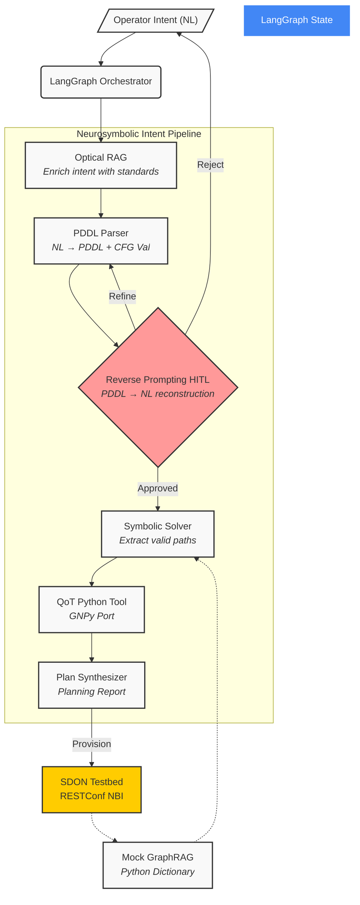

# Architecture V4: Neurosymbolic Intent Orchestration

## 1. Executive Summary

This document defines the V4 system architecture for the **Neurosymbolic Intent Orchestration** of Software-Defined Optical Networks (SDON). Designed as a response to the inherent limitations of purely generative LLM pipelines (token saturation, hallucinated physics, semantic drift), this architecture implements a strict "Sistema 1 (Generative) + Sistema 2 (Symbolic)" separation.

The system translates natural language intent into deterministic Planning Domain Definition Language (PDDL) states, mathematically bounds human-in-the-loop (HITL) convergence via Reverse Prompting, filters valid topologies using a Symbolic Solver, and finalizes paths using a deterministic Python QoT tool.

**Scope pivot rationale:** See [[Scope_Pivot_20260706]] for the research and industry feedback motivating this neurosymbolic focus.

## 2. Design Principles

1. **Strict Neurosymbolic Separation:** The LLM does not decide optical routes; it only translates intent into formal PDDL constraints. A non-neural symbolic solver determines path feasibility.
2. **Mathematical HITL Convergence:** The operator does not simply review a generated report; they approve a "Reverse Prompted" natural language reconstruction of the exact PDDL constraints the system parsed, preventing semantic drift.
3. **Mock GraphRAG for Context Bounding:** Rather than dumping the entire RESTConf topology JSON into the LLM, a mock GraphRAG layer fetches only the k-hop neighborhood required, preventing context saturation.
4. **Pragmatic MVP Design:** Given the August 25 deadline, the PDDL symbolic solver and GraphRAG will be implemented as lightweight Python modules rather than requiring heavy third-party graph databases (e.g., Neo4j).

## 3. System Overview

### 3.1 Architecture Diagram

## 4. Phase-by-Phase Workflow

### Phase 1: Intent Ingestion & Optical RAG
The operator submits a natural language request. The system may query local documentation (like ITU-T specs or specific transponder data) to add missing context before passing the prompt to the LLM.

### Phase 2: PDDL Parsing
The LLM reads the enriched intent and generates a simplified PDDL string (or equivalent symbolic constraint object). A CFG (Context-Free Grammar) validator checks the string to ensure syntactical correctness, blocking structural hallucinations.

### Phase 3: Formal HITL (Reverse Prompting)
An inverse function (or separate LLM call) reads the PDDL constraints and rewrites them in plain natural language (e.g., "I understand you need a path with max 10ms latency ignoring fiber aging constraints"). The user approves this reconstruction (`interrupt()`), guaranteeing that the internal state matches their intent.

### Phase 4: Symbolic Solver & Mock GraphRAG
The approved PDDL constraints are sent to a simple Python-based symbolic solver. The solver requests a compressed local neighborhood from the testbed topology (Mock GraphRAG) and calculates a maximum of 3 to 5 candidate paths that meet the topological rules.

### Phase 5: QoT Validation
The 3-5 structurally valid paths are sent to the Python QoT Tool (translated from C++). The tool executes the GN-model math to calculate the exact GSNR and receiver power, ensuring physical layer validity.

### Phase 6: Synthesis & Provisioning
The Orchestrator summarizes the feasible paths into a Planning Report. Upon final approval, the configuration is pushed to the testbed via SSH/RESTConf.

## 5. Technology Stack (MVP Focused)

| Component | Technology | Package |
|---|---|---|
| Orchestration framework | LangGraph | `langgraph` |
| LLM provider | Kimi (via Professor) | `langchain-openai` or specific SDK |
| State persistence | LangGraph Checkpointer | `langgraph` |
| Symbolic Solver | Python Custom MVP | `src/core/symbolic_solver.py` |
| GraphRAG | Mock Python Dictionary | `src/core/mock_graphrag.py` |
| QoT Validation | Python Port | `src/tools/qot_tool.py` |
| Testbed NBI | SSH / RESTConf | `paramiko` / `httpx` |

## 6. Cross-References

- [[Scope_Pivot_20260706]] — Rationale for this neurosymbolic focus.
- [[ProblemStatement_v4]] — Thesis problem definition.
