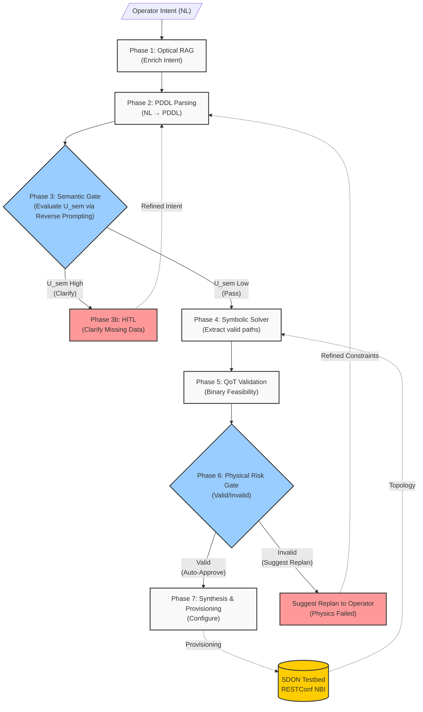

# Architecture V5: Risk-Adaptive Neurosymbolic Intent Planning

## 1. Executive Summary

This document defines the V5 system architecture for the **Risk-Adaptive Neurosymbolic Intent Planning** of Software-Defined Optical Networks (SDON). Building upon the V4 neurosymbolic foundation, V5 introduces a **Risk-Adaptive Decision Pipeline** — a pre-deployment, fail-fast mechanism that sequentially evaluates semantic uncertainty and physical-layer QoT risk to determine the appropriate action for each operator intent.

The system translates natural language intent into PDDL. Before executing expensive symbolic solvers and physical simulations, a **Semantic Uncertainty Gate** evaluates if the intent is clear, triggering a targeted HITL request for missing data if it is not. Once semantically clear, the system filters valid topologies, validates physical feasibility, and applies a **Physical Risk Gate** to decide whether the plan should be **auto-approved**, **suggest replanning** with alternative paths, or **rejected** to prevent unfeasible deployments.

**Key distinction from prior work:** Existing systems (e.g., El Hachimi et al., CNSM 2025) use fixed retry loops *after* deployment failure. This architecture applies a fail-fast risk evaluation *before* deployment, saving compute by catching semantic ambiguity early and preventing physically infeasible lightpaths from reaching the network controller.

**Evolution rationale:** See [[Scope_Pivot_20260706]] for the complete architectural journey from V2 through V5.

## 2. Design Principles

1. **Strict Neurosymbolic Separation.** The LLM does not decide optical routes — it only translates intent into formal PDDL constraints. A non-neural symbolic solver determines path feasibility.
2. **Risk-Proportional HITL Engagement.** The operator is not always interrupted (expensive, slow) nor never consulted (unsafe). The RADG engages the human only when the assessed risk warrants it, based on joint semantic and QoT signals.
3. **Pre-Deployment Safety.** No configuration is pushed to the network without passing the RADG. Unlike post-deployment retry systems, physically infeasible or semantically ambiguous plans are caught before they can cause harm.
4. **Mock GraphRAG for Context Bounding.** Rather than dumping the entire RESTConf topology JSON into the LLM, a mock GraphRAG layer fetches only the $k$-hop neighborhood required, preventing context saturation.
5. **Pragmatic MVP Design.** Given the August 25 deadline, the PDDL symbolic solver, GraphRAG, and RADG will be implemented as lightweight Python modules.

## 3. System Overview

### 3.1 Architecture Diagram

## 4. Phase-by-Phase Workflow

### Phase 1: Intent Ingestion & Optical RAG
The operator submits a natural language request. The system may query local documentation (ITU-T specs, transponder datasheets) to add missing context before passing the enriched prompt to the LLM.

### Phase 2: PDDL Parsing (CFG Validated)
The LLM reads the enriched intent and generates a simplified PDDL string. A deterministic CFG (Context-Free Grammar) regex validator checks the string for syntactical correctness, blocking structural hallucinations. The CFG validation result feeds the first layer of $U_{sem}$.

### Phase 3: Semantic Uncertainty Gate & HITL ($U_{sem}$)
Implementing a **fail-fast** principle, the system assesses Semantic Uncertainty ($U_{sem}$) *before* any complex routing or physics calculations:
- *Layer 1 (Structural)*: Did the PDDL pass CFG validation?
- *Layer 2 (Semantic)*: Does the Reverse Prompting reconstruction match the original operator intent?
**Action**: If $U_{sem}$ is high, the system immediately halts and triggers the HITL interface, proactively asking the operator to provide specific missing constraints or clarify the intent. Once low (cleared), it proceeds to Phase 4.

### Phase 4: Symbolic Solver & Mock GraphRAG
The validated PDDL constraints are sent to a Python-based symbolic solver. The solver requests a compressed local neighborhood from the testbed topology (Mock GraphRAG) and calculates 3–5 candidate paths that satisfy the topological rules.

### Phase 5: QoT Validation
The structurally valid paths are sent to the Python QoT Tool (GN-model port). The tool computes the exact GSNR for each candidate and produces a binary feasibility verdict ($\text{GSNR}_{computed} \ge \text{GSNR}_{threshold}$).

### Phase 6: Physical Risk Decision Gate
This gate evaluates the binary physical safety of the proposed paths:

| Decision | Condition | Action |
|----------|-----------|--------|
| **Auto-Approve** | Valid (Feasible) | Proceed directly to Synthesis — no human review needed |
| **Suggest Replan** | Invalid (Unfeasible) | Physics failed. Notify operator and suggest relaxing constraints (e.g. lower GSNR or protection) via HITL $\to$ Loop back to Phase 2. |

### Phase 7: Synthesis & Provisioning
The Orchestrator summarizes the feasible, approved paths into a Planning Report including the full decision trace. Upon final approval, the configuration is pushed to the testbed via SSH/RESTConf.

## 5. Technology Stack (MVP Focused)

| Component | Technology | Package/Location |
|-----------|-----------|-----------------|
| Orchestration framework | LangGraph | `langgraph` |
| LLM provider | Kimi (via Professor) | `langchain-openai` or specific SDK |
| State persistence | LangGraph Checkpointer | `langgraph` |
| PDDL Validator | Python CFG Regex | `src/core/pddl_validator.py` |
| Symbolic Solver | Python Custom MVP | `src/core/symbolic_solver.py` |
| GraphRAG | Mock Python Dictionary | `src/core/mock_graphrag.py` |
| QoT Validation | Python GN-Model Port | `src/tools/qot_tool.py` |
| **RADG** | **Python Decision Module** | **`src/core/radg.py`** |
| Semantic Similarity | Sentence Embeddings | `sentence-transformers` or LLM-based |
| Testbed NBI | SSH / RESTConf | `paramiko` / `httpx` |

## 6. What Changed from V4 to V5

| Aspect | V4 | V5 |
|--------|----|----|
| **Core Novelty** | Reverse Prompting convergence | Fail-fast, sequential Semantic ($U_{sem}$) and Physical ($R_{qot}$) risk assessment |
| **HITL Strategy** | Always-on (every intent) | Risk-adaptive (early trigger only when semantic uncertainty is high) |
| **Pre-deployment Safety** | Implicit via pipeline stages | Explicit via two-stage Decision Gates |
| **Decision Outcomes** | Approve / Refine / Reject (binary) | Auto-Approve / Clarify / Suggest Replan (3 outcomes, looping to Phase 2) |
| **Evaluation** | Ad-hoc demo | Formal baselines + metrics (UAR, HIC, QFR, E2EL, TC) |
| **Prior Art Positioning** | Against Confucius, AutoLight | + PoliMi/CNSM 2025 (retry-based) |

## 7. Cross-References

- [[Scope_Pivot_20260706]] — Complete architectural evolution from V2 through V5.
- [[ProblemStatement_v5]] — Thesis problem definition with evaluation framework.
- [[experiments/MVP_Roadmap]] — Sprint plan including RADG implementation and baseline evaluation.
- [[literature/sota_gap_analysis]] — Gap analysis positioning against SOTA including PoliMi/CNSM 2025.
