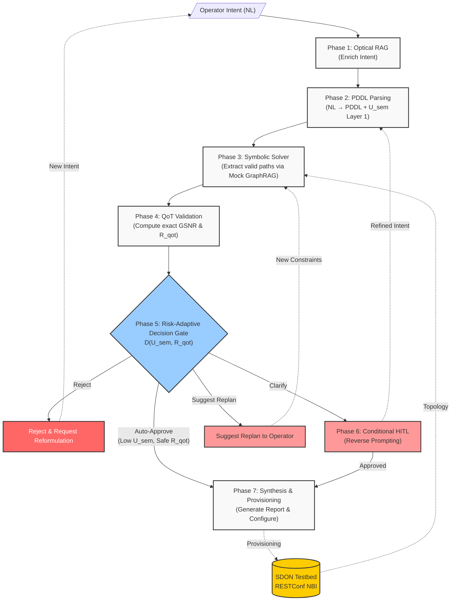

# Architecture V5: Risk-Adaptive Neurosymbolic Intent Planning

## 1. Executive Summary

This document defines the V5 system architecture for the **Risk-Adaptive Neurosymbolic Intent Planning** of Software-Defined Optical Networks (SDON). Building upon the V4 neurosymbolic foundation, V5 introduces a **Risk-Adaptive Decision Gate (RADG)** — a pre-deployment mechanism that jointly evaluates semantic uncertainty and physical-layer QoT risk to determine the appropriate action for each operator intent.

The system translates natural language intent into deterministic PDDL constraints, filters valid topologies using a Symbolic Solver, validates physical feasibility using a deterministic QoT tool, and — critically — uses the RADG to decide whether the plan should be **auto-approved**, whether the operator should be asked to **clarify** their intent, whether the system should **suggest replanning** with alternative paths, or whether the intent should be **rejected** with a request for the operator to reformulate.

**Key distinction from prior work:** Existing systems (e.g., El Hachimi et al., CNSM 2025) use fixed retry loops *after* deployment failure. This architecture evaluates risk *before* deployment to prevent unsafe or physically infeasible lightpaths from ever reaching the network controller.

**Evolution rationale:** See [[Scope_Pivot_20260706]] for the complete architectural journey from V2 through V5.

## 2. Design Principles

1. **Strict Neurosymbolic Separation.** The LLM does not decide optical routes — it only translates intent into formal PDDL constraints. A non-neural symbolic solver determines path feasibility.
2. **Risk-Proportional HITL Engagement.** The operator is not always interrupted (expensive, slow) nor never consulted (unsafe). The RADG engages the human only when the assessed risk warrants it, based on joint semantic and QoT signals.
3. **Pre-Deployment Safety.** No configuration is pushed to the network without passing the RADG. Unlike post-deployment retry systems, physically infeasible or semantically ambiguous plans are caught before they can cause harm.
4. **Mock GraphRAG for Context Bounding.** Rather than dumping the entire RESTConf topology JSON into the LLM, a mock GraphRAG layer fetches only the $k$-hop neighborhood required, preventing context saturation.
5. **Pragmatic MVP Design.** Given the August 25 deadline, the PDDL symbolic solver, GraphRAG, and RADG will be implemented as lightweight Python modules.

## 3. System Overview

### 3.1 Architecture Diagram

## 4. Phase-by-Phase Workflow

### Phase 1: Intent Ingestion & Optical RAG
The operator submits a natural language request. The system may query local documentation (ITU-T specs, transponder datasheets) to add missing context before passing the enriched prompt to the LLM.

### Phase 2: PDDL Parsing (CFG Validated)
The LLM reads the enriched intent and generates a simplified PDDL string. A deterministic CFG (Context-Free Grammar) regex validator checks the string for syntactical correctness, blocking structural hallucinations. The CFG validation result feeds the first layer of $U_{sem}$.

### Phase 3: Symbolic Solver & Mock GraphRAG
The PDDL constraints are sent to a Python-based symbolic solver. The solver requests a compressed local neighborhood from the testbed topology (Mock GraphRAG) and calculates 3–5 candidate paths that satisfy the topological rules.

### Phase 4: QoT Validation
The structurally valid paths are sent to the Python QoT Tool (GN-model port). The tool computes the exact GSNR and receiver power for each candidate, producing both a feasibility verdict and a **QoT risk margin** ($R_{qot}$).

### Phase 5: Risk-Adaptive Decision Gate (RADG)

This is the **core contribution**. The RADG receives two orthogonal risk signals:

**Semantic Uncertainty ($U_{sem}$)** — Two-layer assessment:
- *Layer 1 (Structural)*: Did the PDDL pass CFG validation? If not, $U_{sem}$ is immediately high.
- *Layer 2 (Semantic)*: If CFG passed, compute the disagreement between the original operator intent and the Reverse Prompting natural language reconstruction using embedding similarity. High disagreement → high $U_{sem}$.

**QoT Risk Margin ($R_{qot}$)** — Physical-layer safety signal:
$$R_{qot} = \text{GSNR}_{computed} - \text{GSNR}_{threshold} \quad [\text{dB}]$$

The RADG applies the decision function $D(U_{sem}, R_{qot})$:

| Decision | Condition | Action |
|----------|-----------|--------|
| **Auto-Approve** | $U_{sem}$ low, $R_{qot} > \epsilon$ | Proceed directly to Synthesis — no human review needed |
| **Clarify** | $U_{sem}$ high, any $R_{qot}$ | Invoke Reverse Prompting HITL — present NL reconstruction to operator for approval/refinement |
| **Suggest Replan** | $U_{sem}$ low, $0 < R_{qot} \le \epsilon$ | Intent is clear but physics are marginal — suggest alternative paths or relaxed constraints to operator |
| **Reject + Request Replan** | Any $U_{sem}$, $R_{qot} \le 0$ | Block deployment — notify operator that the intent violates physical constraints and request a new, reformulated intent |

Where $\epsilon$ is a configurable safety margin (e.g., 1–2 dB).

### Phase 6: Conditional HITL (Reverse Prompting)
**Triggered only when RADG routes to "Clarify."** An inverse LLM call reads the PDDL constraints and rewrites them in plain natural language. The operator approves, refines, or rejects this reconstruction via LangGraph `interrupt()`. If refined, the pipeline loops back to Phase 2.

### Phase 7: Synthesis & Provisioning
The Orchestrator summarizes the feasible, RADG-approved paths into a Planning Report including the full decision trace ($U_{sem}$, $R_{qot}$, RADG outcome). Upon final approval, the configuration is pushed to the testbed via SSH/RESTConf.

## 5. Technology Stack (MVP Focused)

| Component | Technology | Package/Location |
|-----------|-----------|-----------------|
| Orchestration framework | LangGraph | `langgraph` |
| LLM provider | Kimi (via Professor) | `langchain-openai` or specific SDK |
| State persistence | LangGraph Checkpointer | `langgraph` |
| PDDL Validator | Python CFG Regex | `src/core/pddl_validator.py` |
| Symbolic Solver | Python Custom MVP | `src/core/symbolic_solver.py` |
| GraphRAG | Mock Python Dictionary | `src/core/mock_graphrag.py` |
| QoT Validation | Python GN-Model Port | `src/tools/qot_tool.py` |
| **RADG** | **Python Decision Module** | **`src/core/radg.py`** |
| Semantic Similarity | Sentence Embeddings | `sentence-transformers` or LLM-based |
| Testbed NBI | SSH / RESTConf | `paramiko` / `httpx` |

## 6. What Changed from V4 to V5

| Aspect | V4 | V5 |
|--------|----|----|
| **Core Novelty** | Reverse Prompting convergence | Joint semantic + QoT risk assessment (RADG) |
| **HITL Strategy** | Always-on (every intent) | Risk-adaptive (only when RADG detects risk) |
| **Pre-deployment Safety** | Implicit via pipeline stages | Explicit via RADG decision function |
| **Decision Outcomes** | Approve / Refine / Reject (binary) | Auto-Approve / Clarify / Suggest Replan / Reject + Request Replan (4 outcomes) |
| **Evaluation** | Ad-hoc demo | Formal baselines + metrics (UAR, HIC, QFR, E2EL, TC) |
| **Prior Art Positioning** | Against Confucius, AutoLight | + PoliMi/CNSM 2025 (retry-based) |

## 7. Cross-References

- [[Scope_Pivot_20260706]] — Complete architectural evolution from V2 through V5.
- [[ProblemStatement_v5]] — Thesis problem definition with evaluation framework.
- [[experiments/MVP_Roadmap]] — Sprint plan including RADG implementation and baseline evaluation.
- [[literature/sota_gap_analysis]] — Gap analysis positioning against SOTA including PoliMi/CNSM 2025.
