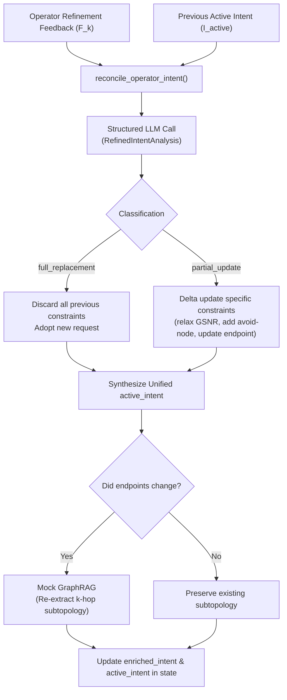

# Feature: Intent Reconciler & Refinement Reasoning

## 1. Architecture Placement
**Phase 2: Intent Reconciliation & PDDL Parsing** | [[Architecture_v5]]

The Intent Reconciler formalizes the semantic binding operator $\mathcal{I}_{\text{eff}}^{(k)} = \text{Reconcile}(\mathcal{I}_{\text{active}}^{(k-1)}, \mathcal{F}_k)$ during Human-in-the-Loop refinement loops (Phase 3b [[architecture/features/semantic_gate|Semantic Gate]] clarification and Phase 6 [[architecture/features/radg|RADG]] replanning). Instead of naive string concatenation (`base_intent + "\n" + feedback`) that causes semantic drift and contradictory prompts, an LLM reasoning engine systematically classifies the update scope (`FULL_REPLACEMENT` vs `PARTIAL_UPDATE`), performs constraint delta analysis, updates physical constraints, and synthesizes a single unified operational intent (`active_intent`).

## 2. Overview
When an operator interacts with the system via `interrupt()` in Phase 3b or Phase 6:
- The operator provides natural language guidance (e.g., *"Lower GSNR to 12 dB"*, *"Change destination to Berlin instead of Munich"*, or *"Cancel that, route from Cologne to Frankfurt"*).
- The Intent Reconciler analyzes the delta between the previous active intent and the new feedback.
- It determines whether the instruction is:
  1. **`FULL_REPLACEMENT`**: The operator completely replaces the previous objective. All previous constraints are purged.
  2. **`PARTIAL_UPDATE`**: The operator adjusts, relaxes, adds, or removes specific constraints (GSNR thresholds, node/link exclusions, latency bounds, or single endpoint modifications) while preserving compatible existing goals.
- If endpoints changed, it re-queries Mock GraphRAG to refresh the scoped $k$-hop subtopology neighborhood (`subtopology_snapshot` and `topology_context`).
- It outputs a unified natural language intent string (`active_intent`) and detailed reasoning (`intent_update_reasoning`), which downstream modules (`pddl_parser`, `semantic_gate`, `plan_synthesizer`) consume without conflicting text.

## 3. How it Works



### Schemas (`src/nodes/intent_reconciler.py`)
```python
class IntentUpdateType(str, Enum):
    FULL_REPLACEMENT = "full_replacement"
    PARTIAL_UPDATE = "partial_update"

class RefinedIntentAnalysis(BaseModel):
    update_type: IntentUpdateType
    reasoning: str
    updated_intent: str
    source_node: str | None = None
    target_node: str | None = None
    modified_constraints: list[str] = Field(default_factory=list)
```

## 4. Requirements & Dependencies
- Python 3.12+
- `langchain-core` / `langchain-openai`
- `pydantic` v2
- `networkx` (for Mock GraphRAG subtopology re-scoping)
- Configured LLM instance accessible via `src.core.llm.get_llm()`

## 5. Associated Files
- **Reconciliation Engine**: [src/nodes/intent_reconciler.py](file:///home/felipeab/MultiAgentON/src/nodes/intent_reconciler.py) — `reconcile_operator_intent()`, `reconcile_and_enrich_intent()`
- **Consuming Node**: [src/nodes/pddl_parser.py](file:///home/felipeab/MultiAgentON/src/nodes/pddl_parser.py) — Phase 2 entrypoint
- **State Schema**: [src/core/state.py](file:///home/felipeab/MultiAgentON/src/core/state.py) — `active_intent`, `intent_update_reasoning`, `intent_update_type`
- **Evaluator Integration**: [src/nodes/semantic_gate_node.py](file:///home/felipeab/MultiAgentON/src/nodes/semantic_gate_node.py) — Layer 2 evaluates directly against `active_intent`
- **Report Integration**: [src/nodes/plan_synthesizer.py](file:///home/felipeab/MultiAgentON/src/nodes/plan_synthesizer.py) — renders `active_intent` and reconciliation rationale
- **Tests**: [tests/unit/test_intent_reconciler.py](file:///home/felipeab/MultiAgentON/tests/unit/test_intent_reconciler.py), [tests/unit/test_pipeline_nodes.py](file:///home/felipeab/MultiAgentON/tests/unit/test_pipeline_nodes.py)

## 6. How to Test
Execute the dedicated unit test suite:
```bash
uv run pytest tests/unit/test_intent_reconciler.py -v
```
Execute the integrated pipeline tests:
```bash
uv run pytest tests/unit/test_pipeline_nodes.py -k "reconcil" -v
```

## 7. Cross-References
- [[Architecture_v5]] — System architecture and Phase 2 description.
- [[architecture/features/pddl_parser]] — Phase 2 PDDL translation.
- [[architecture/features/semantic_gate]] — Semantic Gate evaluated against `active_intent`.
- [[architecture/features/plan_synthesizer]] — Planning report formatting.
- [[experiments/bugs/bug009_Semantic_Gate_Refinement_Drift]] — Resolution of multi-turn semantic drift.
