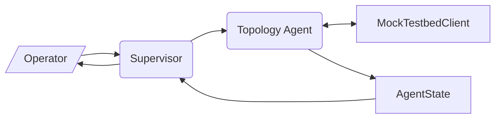

# Experiment 001: Topology Query MVP

## 1. Objective

Validate the end-to-end LangGraph pipeline for the simplest possible agentic interaction: an operator queries the system about the current network topology, and the system autonomously fetches, structures, and presents the information.

## 2. Hypothesis

A minimal LangGraph `StateGraph` with two agent nodes (Supervisor + Topology) and one deterministic tool (`fetch_topology`) can:
1. Parse a natural-language topology query into a structured task delegation.
2. Execute the delegation via tool invocation against a mock testbed.
3. Update the shared state with the topology snapshot.
4. Synthesize a human-readable response from the structured data.

## 3. Scope

### In Scope
- Supervisor Node with LLM integration (Kimi API, OpenAI-compatible via `langchain-openai`).
- Topology Agent node with `fetch_topology` tool.
- `MockTestbedClient` returning realistic topology data based on the ECOC 4-node testbed.
- `AgentState` TypedDict with Pydantic schemas for type safety.
- Full test suite with Strict TDD.

### Explicitly Out of Scope
- ❌ HITL approval (not needed for read-only topology queries).
- ❌ Routing Agent / QoT Tool.
- ❌ Lightpath provisioning.
- ❌ Real testbed connection (requires SSH/VPN).
- ❌ Persistent memory / Knowledge Graph DB (in-memory Pydantic models).
- ❌ RAG / Vector search.

## 4. Test Flow

```
Step 1: Operator types "What is the current topology of the testbed?"
Step 2: Supervisor (LLM) parses intent → determines it's a topology query
Step 3: Supervisor routes state to Topology Agent
Step 4: Topology Agent calls fetch_topology tool → MockTestbedClient responds
Step 5: State.topology_snapshot is updated with structured Pydantic model
Step 6: Supervisor reads updated state → formulates human-readable response
Step 7: Operator receives structured answer about nodes, links, and services
```

## 5. Architecture Subset

This experiment exercises the following subset of [[Architecture_v2]]:



## 6. Mock Topology Data

Based on the ECOC 2024 paper's testbed, the mock returns a 4-node linear network:

```
Node1 (Milano-A) ←→ Node2 (Milano-B) ←→ Node3 (Milano-C) ←→ Node4 (Milano-D)
```

Each link includes:
- Fiber span length (km)
- Number of optical amplifiers (OAs)
- Active channel count

## 7. Success Criteria

| Criterion | Metric |
|-----------|--------|
| Intent correctly classified as topology query | Supervisor output contains `task_type: "topology_query"` |
| Topology data successfully fetched | `AgentState.topology_snapshot` is not None after execution |
| Structured response generated | Final message contains node names and link details |
| All tests pass | `pytest tests/ -v` exits with code 0 |
| Test coverage | ≥ 80% on `src/` |

## 8. File Structure

See [[Architecture_v2]] §9 for the full implementation roadmap.

```
src/
├── agents/
│   ├── __init__.py
│   ├── supervisor.py
│   └── topology.py
├── core/
│   ├── __init__.py
│   ├── state.py
│   └── graph.py
├── services/
│   ├── __init__.py
│   └── testbed_client.py
├── tools/
│   ├── __init__.py
│   └── fetch_topology.py
└── main.py

tests/
├── conftest.py
├── test_state.py
├── test_supervisor.py
├── test_topology.py
├── test_graph.py
└── test_testbed_client.py
```

## 9. Dependencies

```toml
[project]
dependencies = [
    "langgraph>=0.4",
    "langchain-core>=0.3",
    "langchain-openai>=0.3",
    "pydantic>=2.0",
    "httpx>=0.28",
    "python-dotenv>=1.1",
]
```

## 10. Cross-References

- [[Architecture_v3]] — Intent Planning System architecture (active)
- [[Tool_Registry]] — `fetch_topology` tool registration
- [[Concepts_and_Terminology]] — SLA, QoT, SDON definitions

> **Scope Pivot Note:** This experiment remains fully valid under the [[Scope_Pivot_20260621|scope pivot]] from full MAS to Intent Planning Loop. The Topology Agent is a core component of the planning loop — it provides the topology snapshot that the Routing Agent uses for QoT-informed path evaluation.
