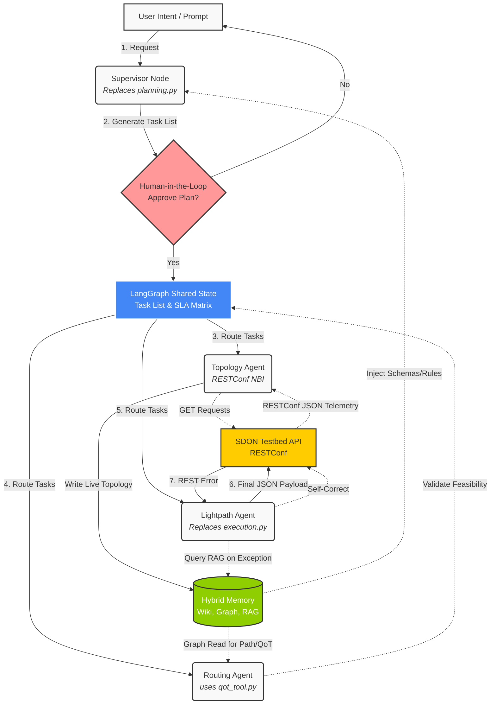

# Proposal: Modernizing the Baseline Orchestrator

## 1. Executive Summary
Following a comprehensive analysis of the provided baseline orchestrator codebase (`ecoc2024-llm-orchestrator`) and the associated ECOC 2024 literature, this document proposes a strategic pivot. While the original Python script successfully demonstrates the viability of LLM-driven SDON configuration, its strictly procedural and stateless nature makes it incompatible with the autonomous, cyclical reasoning required for our `MultiAgentON` project. 

However, rather than starting from scratch, we propose **reusing the core logical pipeline and data schemas** from the baseline, porting them into a modernized **LangGraph Multi-Agent Architecture**.

---

## 2. Codebase Analysis: What We Evaluated
The original repository is built on a two-phase pipeline using pure Python and `llama_cpp`:
1. `planning.py`: Uses an LLM to translate human intent into a structured list of tasks.
2. `execution.py`: Loops over the task list, prompting the LLM to generate valid RESTConf payloads using Constrained Generation (JSON Schemas + GBNF grammars).

---

## 3. The Gap: Why We Cannot Use the Script "As-Is"

1. **Stateless vs. Agentic**: The baseline is a linear script. It runs once from top to bottom. Our project requires an autonomous agent capable of cyclical reasoning, dynamic tool selection, and state tracking across multiple turns of a conversation.
2. **Lack of Memory**: The script does not retain episodic or topological memory. As documented in our [[Hybrid_Memory_Architecture]], tracking complex network states requires a Graph database and RAG systems, which the baseline lacks entirely.
3. **Hardcoded Local Inference**: The baseline is tightly coupled to local `mixtral` GGUF execution. LangGraph provides the necessary abstraction to route requests across different LLM providers depending on the cognitive complexity of the task.

---

## 4. The Bridge: What We WILL Reuse (The "Not Starting from Zero" List)

The baseline contains incredibly valuable assets that we will integrate into our LangGraph setup:

- **The Pipeline Logic**: The logical separation of `Intent -> Planning -> Execution -> Error Handling` is a robust pattern that we will map directly to our LangGraph nodes.
- **The RESTConf Interaction Model**: The paper establishes that the SDON testbed's Northbound Interface (NBI) is RESTConf based. Our agents will use this exact standard to interact with the network.
- **JSON Schemas**: The schemas located in `data/json_schemas` (`lightpath_schema.json`, `measurement_schema.json`, `service_schema.json`) are the most valuable artifacts. We will convert these into Pydantic models for LangChain's `with_structured_output`, completely bypassing the need to write network validation from scratch.

---

## 5. Proposed Architecture: The LangGraph Orchestrator (V2 Integration)

We propose transforming the procedural steps of the baseline into discrete Nodes within a robust LangGraph `StateGraph`. This unifies the professor's orchestration logic with our previously designed **Multi-Agent Sequential Workflow** ([[Architecture_Workflow_20260427_Felipe_Abadia]]) and **[[Hybrid_Memory_Architecture]]**.

### 5.1 The Memory Substrate (Foundation & Active Utility)
The Orchestrator relies on a tri-partite memory system (Wiki, Graph, RAG) that plays a **dual role** across the workflow:
1. **Initialization:** Before parsing intents, the memory injects deterministic rules and base schemas (like the JSON schemas from the baseline) into the Supervisor Node.
2. **Active Utility:** During execution, the memory acts as a live, omnipresent layer. Sub-agents can actively query it to fetch specific data or log historical resolutions without cluttering the main context window.

### 5.2 Phase 1: Intent Parsing & Human-in-the-Loop (HITL)
- **Supervisor Node (Replaces `planning.py`)**: Translates high-level semantic commands into a numerical SLA matrix and a structured task list.
- **Validation Node (HITL)**: To prevent "Garbage In, Garbage Out", the graph halts here. The Orchestrator explains its plan back to the human operator. The state only proceeds to execution once authorized (`is_authorized = True`).

### 5.3 Phase 2: Sub-Agent Delegation (Replaces `execution.py`)
The Supervisor delegates tasks to ephemeral, specialized sub-agents. Alongside the initial schemas they receive, agents maintain dynamic access to the memory:
- **Topology & Measurement Agent**: Queries the RESTConf NBI to extract physical testbed data (fiber lengths, OAs) and actively **updates the Knowledge Graph state**.
- **Routing Agent**: Responsible for path selection. It directly wraps the newly ported Python Physics model (`qot_tool.py`, see [[experiments/Proposal_QoT_Integration]]) as a deterministic tool. This ensures mathematical [[QoT_Awareness|SNR]] validation in milliseconds *before* any payload is generated, minimizing Goal-Oriented Task (GoT) cost and latency by bypassing LLM semantic processing for physical calculations.
- **Lightpath & Provisioning Agent**: Generates the exact RESTConf JSON payloads using the imported baseline schemas to establish valid connections.

### 5.4 Phase 3: Conflict Resolution & The "Fast Loop" Handoff
- **Iterative Feedback**: If the SDON Testbed returns a REST error (e.g., "ID already taken", mimicking the paper's Step 3) or if the Routing Agent's QoT tool flags an infeasible path, a **Conditional Edge** routes the graph back to the responsible agent for self-correction.
- **Episodic Fallback (Dynamic RAG Access)**: During self-correction, if a standard fix isn't obvious, the agent dynamically **queries the Vector RAG** with the error context to fetch the correct historical workaround.
- **Execution**: Once the multi-agent graph resolves all constraints, the Orchestrator pushes the final valid API payload down to the SDN Controller (The Fast Loop).

### 5.5 Comprehensive Architecture Diagram

---

## 6. Resolution: Topology Extraction

A pending architectural question was whether the testbed topology (e.g., fiber lengths, EDFA locations) required manual configuration files or could be extracted dynamically.

Based on the ECOC 2024 paper's explicit definition of the NBI, **all testbed data can be dynamically requested via the RESTConf API**. 
Therefore, our LangGraph system will implement a **Topology Agent** tasked with executing `GET` requests to the controller's NBI, parsing the JSON/YAML responses, and updating our internal Knowledge Graph at runtime. This completely eliminates the need for static, hardcoded topology files.
