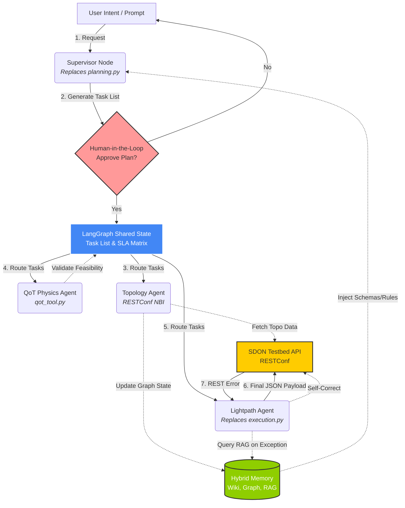

# Orchestrator Architecture V2 — Professor Slide Deck

---

## Slide 1: What We Analyzed

**The Baseline: `ecoc2024-llm-orchestrator`** (see [[literature/OrchestratorScriptReport]] for full analysis)

- Two-phase procedural pipeline using `llama_cpp` + Mixtral (GGUF):
  - `planning.py` → Decomposes human intent into a structured task list (JSON).
  - `execution.py` → Iterates tasks, generates RESTConf payloads via **Constrained Generation** (GBNF grammars + JSON Schemas).
- **Key Strength**: Guarantees 100% valid JSON output through grammar-level token filtering.
- **Key Limitation**: Stateless, linear, single-run script with no memory or agentic capabilities.

---

## Slide 2: Why We Cannot Use It "As-Is"

| Baseline Script | Our Requirement (MultiAgentON) |
|---|---|
| Procedural (runs top-to-bottom once) | Cyclical reasoning with conditional loops |
| No memory (stateless) | [[Hybrid_Memory_Architecture]] with Wiki, Graph, RAG |
| Hardcoded to local `llama_cpp` | LLM-agnostic (swap providers per task complexity) |
| No error recovery beyond retry | Autonomous error correction with episodic recall |
| No human validation | Human-in-the-Loop (HITL) before execution |

**Conclusion**: The script is a proof-of-concept, not an agentic framework. We need **LangGraph**.

---

## Slide 3: What We WILL Reuse (Not Starting from Zero)

1. **Pipeline Logic**: The `Intent → Planning → Execution → Error Handling` pattern maps directly to LangGraph nodes.
2. **JSON Schemas**: The schemas from `data/json_schemas/` (`lightpath_schema.json`, `measurement_schema.json`, `service_schema.json`) will be converted to **Pydantic models** for LangChain's `with_structured_output`.
3. **RESTConf Interaction Model**: Our agents will use the same RESTConf standard to communicate with the SDON Testbed's NBI.

---

## Slide 4: The Hybrid Memory Substrate (Dual Role)

The memory system plays **two roles** across the workflow:

1. **Initialization**: Injects deterministic rules and base schemas into the Supervisor Node before intent parsing.
2. **Active Utility**: Sub-agents dynamically query it during execution:
   - **Topology Agent** → Updates the Knowledge Graph with live testbed state.
   - **Lightpath Agent** → Queries Vector RAG on exception for historical error resolutions.

| Memory Pillar | Role | Example |
|---|---|---|
| **Wiki** (Procedural) | Rules & schemas | JSON schemas from the baseline |
| **Knowledge Graph** (Topological) | Live network state | Fiber lengths, EDFA locations ([[QoT_Awareness]]) |
| **Vector RAG** (Episodic) | Error recovery | "How was HTTP 409 resolved last time?" |

---

## Slide 5: The V2 LangGraph Architecture

---

## Slide 6: Topology Extraction — Resolved

**Previous Question**: Will testbed data (fiber lengths, OA locations) be accessed via REST API or static configuration files?

**Answer (from ECOC 2024 Paper)**: The Northbound Interface (NBI) of the SDON controller uses **RESTConf**. All topology data can be dynamically requested via HTTP GET.

**Implication**: Our **Topology Agent** will:
1. Issue `GET` requests to the controller's RESTConf NBI.
2. Parse the JSON/YAML responses.
3. Update the internal **Knowledge Graph** at runtime.

→ **Zero static files. Fully dynamic.**

---

## Slide 7: Next Steps

1. **Await Professor Approval** on this architecture and the [[experiments/Proposal_QoT_Integration|QoT Python Port]].
2. **Begin QoT Implementation**: Translate GN model math (`calculateDemandSNR`, `spanSNR`) into `qot_tool.py`.
3. **Begin StateGraph Coding**: Implement the Supervisor Node, HITL validation, and the first sub-agent (Topology Agent).
