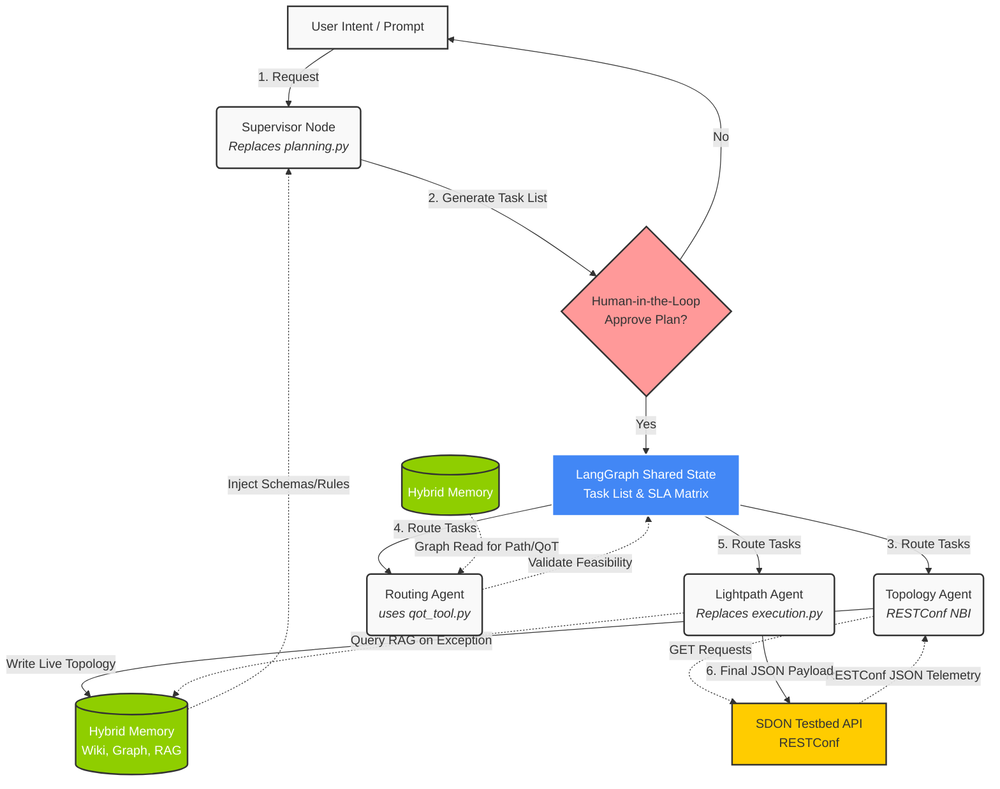
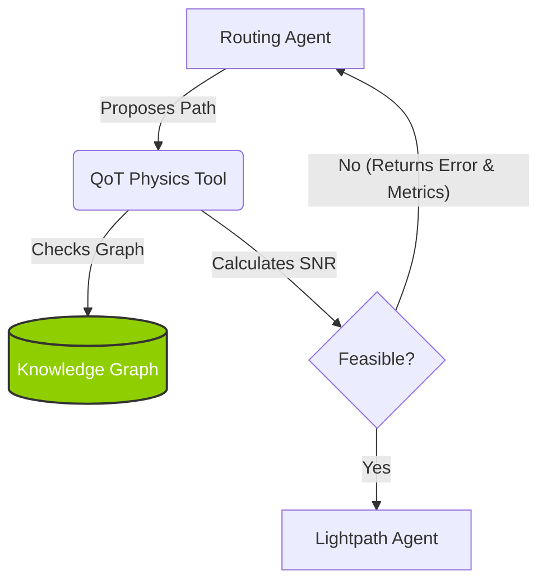

# Orchestrator Architecture V2 & QoT Physics Port
> [!LAYOUT]
> Center the title. Add the MultiAgentON logo at the bottom left, and your university/lab logo at the bottom right.

<!-- Speaker Notes: 
Good morning/afternoon everyone. Today I'm going to present the evolution of our MultiAgentON architecture. We'll cover the transition to LangGraph V2, the resolution of our topology extraction strategy using RESTConf, and how the QoT physics simulator integrates seamlessly into this new design.
-->

---

## Slide 1: The Baseline Orchestrator (ECOC 2024)

> [!LAYOUT]
> Two-column layout. Left: The bullet points. Right: A simple flowchart or block diagram showing Intent -> Planning.py -> Execution.py.

- **The Foundation:** We analyzed the `ecoc2024-llm-orchestrator` repository (see [[literature/OrchestratorScriptReport]]).
- **How it Works:** Uses a two-phase procedural pipeline (Planning + Execution) with `llama_cpp`.
- **Key Strength:** Employs Constrained Generation (JSON Schemas + GBNF) to guarantee 100% valid RESTConf payloads.
- **The Limitation:** It's a stateless, linear script. It lacks the cyclical reasoning and memory needed for a true autonomous Multi-Agent System.

<!-- Speaker Notes: 
We started by evaluating the orchestrator codebase from the ECOC 2024 paper. It's a brilliant proof of concept, primarily because it completely eliminates JSON formatting errors using constrained generation. However, because it runs strictly from top to bottom without memory, we can't use the Python scripts 'as-is' for our agentic MAS.
-->

---

## Slide 2: The Transition to LangGraph V2

> [!LAYOUT]
> Single column, bullet points. Consider a subtle background image representing a network graph.

**What we are migrating:**
- **Pipeline Logic:** The `Intent → Planning → Execution → Error Handling` logic is perfect. We map this to LangGraph nodes.
- **Schemas:** We adopt their RESTConf JSON schemas (`lightpath_schema.json`, etc.) and convert them to Pydantic models for LangChain.

**What we are replacing:**
- We transition from procedural scripts to **Cyclical Reasoning** (StateGraph).
- We introduce **Human-in-the-Loop (HITL)** validation before execution.
- We integrate our **[[Hybrid_Memory_Architecture]]** (Wiki, Graph, RAG) for context management.

<!-- Speaker Notes: 
So, we aren't starting from scratch. We are porting the robust pipeline logic and the JSON schemas into a modern LangGraph architecture. This gives us the reliability of the baseline, combined with cyclical reasoning and memory. 
-->

---

## Slide 3: Resolving Topology Extraction

> [!LAYOUT]
> Large emphasized text in the center, or a simple diagram showing the SDON Controller sending JSON to the Topology Agent.

- **The Challenge:** How to get real-time fiber lengths and amplifier data without rigid `.dat` files?
- **The Solution:** The baseline NBI operates on **RESTConf**. 
- **The Flow:**
  1. Our **Topology Agent** issues HTTP `GET` requests to the SDON Controller.
  2. It parses the JSON/YAML responses.
  3. It dynamically updates our **Knowledge Graph** (Pillar 2 of [[Hybrid_Memory_Architecture]]).
- **Result:** A live Digital Twin in memory. Zero static files.

<!-- Speaker Notes: 
One of our biggest open questions was how to extract physical topology. The ECOC paper confirms the testbed uses RESTConf. Therefore, we designed a specific Topology Agent that simply polls the RESTConf API and updates our internal Knowledge Graph. This creates a perfect, live digital twin for our other agents to consume.
-->

---

## Slide 4: QoT Physics Decoupled

> [!LAYOUT]
> Two-column layout. Left: Bullet points explaining the physics port. Right: A code snippet or a visual representation of `qot_tool.py`.

- **The Challenge:** The provided `Code_for_Felipe` is a heavy C++ Genetic Algorithm solver. Spawning subprocesses for every path evaluation is too slow.
- **The Pivot (Python Port):** We are extracting the core Gaussian Noise (GN) math from `Network.cpp` into a native LangGraph tool ([[tools_wiki/QoT_Tool|qot_tool.py]]).
- **Mapped Physics Functions:**
  - `calculateDemandSNR`: Computes the end-to-end signal-to-noise ratio for a specific lightpath request.
  - `calculatePropagatedSNR`: Models the accumulation of linear and nonlinear noise across successive spans.
  - `spanSNR`: Evaluates the physical impairment contributions (ASE and NLI) per individual fiber/amplifier span.
- **Data Source:** The tool queries topology directly from the in-memory **Knowledge Graph**, not from static files.
- **Output:** Returns numeric SNR and Power in milliseconds directly to the agent's execution context.

<!-- Speaker Notes: 
With the digital twin established in our Knowledge Graph, the QoT validation becomes elegant. Instead of wrapping the heavy C++ optimization binary, we are porting just the core physics functions—calculateDemandSNR, calculatePropagatedSNR, and spanSNR—to Python. This tool reads the topology from our graph and calculates the SNR in milliseconds, returning actionable numeric data to the LLM.
-->

---

## Slide 5: Comprehensive Orchestration Architecture

> [!LAYOUT]
> Full slide Mermaid Diagram representing the global multi-agent orchestrator architecture.

<!-- Speaker Notes: 
This slide presents our complete, end-to-end multi-agent orchestration architecture. It starts with user intent being processed by a Supervisor Node that replaces the baseline planning script. After Human-in-the-Loop approval, tasks are written to the shared state and routed to our three specialized sub-agents: the Topology Agent to keep our memory synchronized, the Routing Agent with our native python QoT tool for fast path validation, and finally the Lightpath Agent to generate and push the RESTConf payload.
-->

---

## Slide 6: The Fast Loop (Error Recovery)

> [!LAYOUT]
> Full slide Mermaid Diagram. You can render the Mermaid diagram directly or screenshot it.

<!-- Speaker Notes: 
This brings us to the Fast Loop. When an agent proposes a route, the QoT tool calculates the physics. If it fails, it doesn't just say 'False'. It returns the specific bottleneck—like 'Span 3 SNR degraded'—triggering a conditional loop back to the Routing Agent. This allows autonomous self-correction before we even touch the real network.
-->

---

## Slide 7: Next Steps & Lab Questions

> [!LAYOUT]
> Standard bullet points.

**Immediate Actions:**
1. **Approval:** Finalize approval for the Python-native physics port.
2. **Translation:** Code the GN model equations into [[tools_wiki/QoT_Tool|qot_tool.py]].
3. **Graph Building:** Implement the Supervisor Node and Topology Agent.

**Questions for the Lab:**
- *Hardware Constants:* Can we map the `Network.cpp` constants to the `measurement_schema.json` context?
- *Gold Standard Benchmark:* Can we obtain a RESTConf JSON payload dump of a verified active service (and its measured SNR) to unit-test our Python port?

<!-- Speaker Notes: 
To wrap up, our next steps are to code the Python physics port and the LangGraph state machine. To ensure mathematical perfection, our main request to the lab is a 'Gold Standard' RESTConf payload dump of an active service, which we will use to unit test the Python port against the physical testbed. Thank you.
-->
