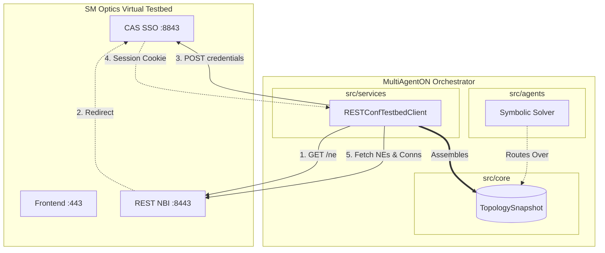

# Session Summary: 2026-07-29 (RESTConf Integration)

## 1. Handover State
- **Previous Session:** Completed the Symbolic Solver (Yen's K-Shortest Paths) and Mock GraphRAG integration. Left unit tests passing but integration tests blocked due to lack of API credentials.
- **Current Goal:** Execute Exp 1.3 by connecting to the live SM Optics virtual testbed.

## 2. Work Accomplished
- **VPN & API Discovery:** The user provided VPN access to `10.79.26.48`. We mapped the port structure: `443` is the Angular frontend, `8443` is the REST NBI, and `8843` is the internal CAS SSO authentication server.
- **CAS SSO Flow Rewrite:** We modified `_authenticate_cas` in `RESTConfTestbedClient` to perform a `GET` request on `8443`, capture the CAS execution token from the redirect to `8843`, and then `POST` the credentials to establish the session. 
- **Absolute URLs Fix:** Removed `base_url` from the `httpx.Client` to accommodate cross-port redirect loops, updating all API methods to use absolute URLs.
- **API Quirks Handling:** Discovered that the SM Optics controller returns a `400 Bad Request` with message "Connection not Found" when zero connections exist for a given type, instead of `200 []`. Updated `get_connections` to catch this `400` error and gracefully return an empty list `[]`.
- **Integration Tests:** Updated `tests/integration/test_onc_api.py` to use a `scope="class"` fixture to share the authenticated session. Refined the tests to accept an empty links array since the testbed currently has no provisioned `infrastructure-eth` connections. All 179 tests (172 unit + 7 integration) pass.

## 3. Codebase Changes & Structure

### Changes in `src/` and `tests/`
- **`src/services/testbed_client.py`**: Rewritten `_authenticate_cas` to trigger redirect from NBI rather than calling CAS directly. Refactored `get_connections` to absorb HTTP 400 errors as empty collections. Removed `base_url` from the internal `httpx` client to support absolute URL cross-port redirects.
- **`tests/integration/test_onc_api.py`**: Switched the `client` fixture to `scope="class"` to ensure CAS is only hit once per test suite. Updated topology expectations to handle 0 provisioned physical links.
- **`tests/unit/test_onc_client.py`**: Mocks updated to reflect the new absolute URL patterns and the `scope="class"` behavior.

### Current Implementation Schematic

## 4. Decisions & Rationale
- **Read-Only Scope:** Agreed with the user to limit Exp 1.3 to a read-only integration (fetching NEs and connections) to avoid corrupting the shared lab testbed.
- **Empty Connections Fallback:** We decided to handle the `400` connection error explicitly as an empty list to keep the orchestrator logic agnostic to vendor-specific REST quirks.

## 4. Next Steps
1. Request the professor to provision physical connections in the testbed (or supply a mock) so the Symbolic Solver has a graph to route over.
2. Request guidance on extracting ON physics parameters from the ONC.
3. Begin Exp 3.1: Rewiring `src/core/radg.py` and `src/core/graph.py` to enact the Architecture V5 pipeline.
