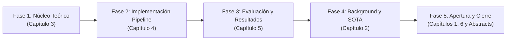

# Master Thesis Writing Roadmap: Risk-Adaptive Neurosymbolic Intent Planning

Este documento establece la estrategia maestra y el orden de redacción para la tesis de maestría:
**"Risk-Adaptive Neurosymbolic Intent Planning for Optical Networks: A Pre-Deployment Decision Mechanism with Joint Semantic and QoT Assessment"**.

Escribir una tesis de ingeniería de posgrado sigue una **estrategia concéntrica (de adentro hacia afuera)**: se redacta primero el núcleo teórico y matemático (Capítulo 3) y la ingeniería del pipeline (Capítulo 4), se continúa con la validación experimental y métricas (Capítulo 5), se fundamenta con el Estado del Arte (Capítulo 2) y se concluye con el marco narrativo exterior (Capítulos 1 y 6, y finalmente el Abstract).

---

## 1. Cronograma y Orden de Ejecución por Fases

| Fase | Capítulo | Nombre | Dependencias Previas | Estado |
| :--- | :--- | :--- | :--- | :--- |
| **Fase 1** | **Capítulo 3** | System Model: The Risk-Adaptive Neurosymbolic Architecture | `Architecture_v5`, `ProblemStatement_v5` | **Borradores Listos** (`3_SystemModel/`) |
| **Fase 2** | **Capítulo 4** | Neurosymbolic Pipeline Implementation | `src/core/`, `src/nodes/`, `src/services/` | Pendiente |
| **Fase 3** | **Capítulo 5** | Experimental Evaluation and Results | Sprint 4 Corpus, 17-Node Nobel-Germany, Kimi Benchmarks | Pendiente (post Sprint 4) |
| **Fase 4** | **Capítulo 2** | Background and State of the Art | `literature/`, SOTA papers (Confucius, AutoLight, PoliMi CNSM'25) | Pendiente |
| **Fase 5** | **Capítulo 1 & 6** | Introduction, Conclusion, and Abstracts | Toda la tesis completada | Pendiente final |

---

## 2. Mapeo Detallado de Capítulos, Subsecciones y Recomendaciones

---

### FASE 1: Capítulo 3 — System Model: The Risk-Adaptive Neurosymbolic Architecture

*Objetivo:* Formalizar matemáticamente el problema de enrutamiento óptico dirigido por intención, aislando el cálculo físico de la traducción lingüística y definiendo la compuerta de decisión adaptativa (RADG).

#### 3.1 Formal Problem Definition
- **Contenido:** Los 5 cuellos de botella (Token Saturation, Hallucinated Physics, Semantic Drift, Reactive Failures, Suboptimal HITL). Definición formal de $G(V,E)$, atributos físicos $\mathbf{p}(e_{ij})$, espacio de entrada ($\mathcal{I}_{NL}, G, \text{GSNR}_{th}$), variables de decisión, cotas de recursos ($T_{max}, t_{exec}$) y función objetivo:
  $$\min_{\mathcal{S}_{PDDL}, \pi^*} \left( \alpha N_{hitl} + \beta T_{tokens} \right) \quad \text{s.t.} \quad D(U_{sem}, \text{QoT}_{valid}) = \text{approve}$$
- **Recomendaciones:** Tratar la seguridad física y semántica como hard constraints ($UAR = 0$), no como penalizaciones blandas. Mantener rigurosidad en LaTeX.
- **Borrador:** `docs/LLM_Wiki/wiki/thesis_drafts/3_SystemModel/3_1_Formal_Problem_Definition.md`

#### 3.2 Conceptual Framework
- **Contenido:** Paradigma *Fail-Fast Pre-Deployment* vs *Reactive Retry*. Diagrama de flujo de 7 fases y ciclo de vida del estado $\mathcal{S}_{state}$.
- **Recomendaciones:** Enfatizar por qué evaluar la incertidumbre semántica antes de los cálculos físicos ahorra ciclos de cómputo y tokens.
- **Borrador:** `docs/LLM_Wiki/wiki/thesis_drafts/3_SystemModel/3_2_Conceptual_Framework.md`

#### 3.3 Strict Neurosymbolic Separation
- **Contenido:** Principio *"LLMs reason, tools calculate"*. Definición del subconjunto PDDL (`(route ?s ?d)`, `(avoid-node ?n)`, `(avoid-link ?u ?v)`, `(max-hops ?h)`, `(min-gsnr ?g)`). Validador CFG $\mathcal{G}_{pddl}$ ($v_{struct} \in \{0, 1\}$). Delegación determinista a Yen's $K$-Shortest Paths.
- **Recomendaciones:** Incluir figura comparativa: LLM End-to-End (alucinaciones) vs Separación Neurosimbólica.
- **Borrador:** `docs/LLM_Wiki/wiki/thesis_drafts/3_SystemModel/3_3_Strict_Neurosymbolic_Separation.md`

#### 3.4 The Risk-Adaptive Decision Gate (RADG)
- **Contenido:** Formulación matemática por tramos de $D(U_{sem}, \text{QoT}_{valid})$. Cálculo de dos capas de $U_{sem}$ (CFG + Reverse Prompting $d_{sem}$). Ecuaciones analíticas del modelo GN (ASE noise, NLI Kerr, acumulación de GSNR en dB). Matriz de decisión completa (`approve`, `clarify`, `replan`).
- **Recomendaciones:** Detallar el plano 2D de decisión ($U_{sem}$ vs $\Delta\text{GSNR}$) identificando las 3 zonas operativas.
- **Borrador:** `docs/LLM_Wiki/wiki/thesis_drafts/3_SystemModel/3_4_Risk_Adaptive_Decision_Gate.md`

#### 3.5 Formal Human-In-The-Loop (HITL) via Reverse Prompting
- **Contenido:** Problema de *Semantic Drift* en chats conversacionales. Protocolo Reverse Prompting (Traducción Forward $\to$ Reconstrucción Reversa $\to$ Contrato Estructurado). Patrón `interrupt()` de LangGraph con persistencia en checkpointer. Garantía de convergencia y preservación monotónica de restricciones ($N_{max} \le 3$).
- **Recomendaciones:** Añadir diagrama de secuencia que ilustre la suspensión, guardado atómico en checkpoint y reanudación con feedback inyectado.
- **Borrador:** `docs/LLM_Wiki/wiki/thesis_drafts/3_SystemModel/3_5_Formal_HITL_Reverse_Prompting.md`

---

### FASE 2: Capítulo 4 — Neurosymbolic Pipeline Implementation

*Objetivo:* Documentar la arquitectura de software real en `src/`, explicando cómo el diseño matemático del Capítulo 3 se traduce a código ejecutable en Python, LangGraph y servicios de red.

#### 4.1 Network State and Knowledge Graph (GraphRAG)
- **Contenido:** Extracción de subtopología de $k$-hops en `src/core/mock_graphrag.py`. Abstracción de la red Nobel-Germany de 17 nodos y 26 enlaces en `MockTestbedClient`. Adaptador RESTCONF NBI con autenticación CAS SSO (`src/services/testbed_client.py`).
- **Recomendaciones:** Explicar cómo el filtrado de $k$-hops reduce drásticamente el tamaño del contexto ($T_{prompt} \ll T_{full}$), evitando la saturación de atención.
- **Referencias:** `[SOTA] INTEGRATION_OF_LIVE_NETWORK_KNOWLEDGE_GRAPHS_WITH_RAG...pdf`, [[architecture/features/testbed_client]].

#### 4.2 Semantic and QoT Validation Modules
- **Contenido:** Implementación de nodos: `intent_ingest_node`, `pddl_parser_node` y validador regex (`src/core/pddl_validator.py`). Motor físico de QoT en `src/core/qot_calculator.py` calibrado para enlaces de 37.5 km a 381.9 km con amplificadores ILAs y boosters.
- **Recomendaciones:** Documentar la calibración de potencia optical ($-15$ a $-11\text{ dBm}$) y cómo se previno la explosión no lineal (BUG-003).
- **Referencias:** `[SOTA] GNPy_as_a_benchmark_for_open_and_disaggregated_optical_networks.pdf`, [[architecture/features/qot_tool]].

#### 4.3 Decision Outcomes and Orchestration Flow
- **Contenido:** Grafo de estados en `src/core/graph.py` y `state.py`. Nodos de decisión: `semantic_gate_node.py` y `radg_node.py`. Manejo de loops de refinamiento y resolución de BUG-007 (evitando bucles infinitos). Síntesis del reporte final en `plan_synthesizer.py`.
- **Recomendaciones:** Incluir tabla con los 7 caminos de ejecución verificados en `tests/unit/test_e2e_pipeline_flow.py`.

---

### FASE 3: Capítulo 5 — Experimental Evaluation and Results

*Objetivo:* Evaluar cuantitativamente la hipótesis de la tesis utilizando el corpus sintético, demostrando que RADG elimina aprobaciones inseguras ($UAR=0$) y reduce la fricción operativa y de tokens frente a los baselines.

#### 5.1 Experimental Setup
- **Contenido:** Topología de prueba (Nobel-Germany 17 nodos, 26 enlaces bidireccionales, SNDlib). Configuración de modelos LLM (`kimi-for-coding-highspeed` y comparativa con razonamiento). Generación del corpus de prueba categorizado: (1) Safe + Clear, (2) Ambiguous ($U_{sem}$ alto), (3) Infeasible QoT.
- **Recomendaciones:** Explicar por qué migrar de una topología lineal de 3 nodos a una red de 17 nodos permitió evaluar rutas multi-hop realistas.

#### 5.2 Performance Metrics
- **Contenido:** Definición formal de las 5 métricas:
  1. *Unsafe Approval Rate (UAR)*: $\frac{N_{\text{unfeasible\_approved}}}{N_{\text{total\_intents}}} \to 0\%$
  2. *Human Interaction Count (HIC)*: Promedio de interrupciones por intención.
  3. *QoT Feasibility Rate (QFR)*: $\frac{N_{\text{feasible\_approved}}}{N_{\text{approved\_plans}}} \to 100\%$
  4. *End-to-End Latency (E2EL)*: Tiempo de ejecución en segundos.
  5. *Token Cost (TC)*: Total de tokens consumidos por intención.

#### 5.3 Performance under Safe Conditions
- **Contenido:** Resultados para intenciones claras y físicamente viables. Demostración de auto-aprobación autónoma ($HIC=0$) sin intervención humana, comparado con *Always-HITL*.

#### 5.4 Performance under Ambiguity and Physical Infeasibility
- **Contenido:** Resultados para intenciones con parámetros faltantes (detección temprana de $U_{sem}$ $\to$ *Clarify*) y rutas con GSNR insuficiente (*Suggest Replan*). Comparación contra el baseline *Reactive-Retry* (tipo PoliMi/CNSM 2025).
- **Recomendaciones:** Demostrar cómo el descarte temprano en la Fase 3 ahorra cómputo frente a intentar simular y desplegar antes de clarificar.

#### 5.5 Summary of Findings
- **Contenido:** Tabla comparativa consolidada (Ours vs No-HITL vs Always-HITL vs Reactive-Retry). Análisis de ahorro de tokens y latencia.

---

### FASE 4: Capítulo 2 — Background and State of the Art

*Objetivo:* Posicionar la tesis dentro de la literatura académica reciente (2024–2026), justificando por qué el enfoque neurosimbólico pre-deployment cubre una brecha no resuelta.

#### 2.1 Agentic AI and Multi-Agent Systems in Intent-Driven Networks
- **Contenido:** Evolución de LLMs monolíticos a sistemas multi-agente en telecomunicaciones. Análisis de *Confucius* (Meta, SIGCOMM 2025), *AutoLight* (SJTU, ECOC 2025) y tutoriales de redes ópticas autónomas (JOCN 2026).
- **Recomendaciones:** Destacar que Confucius no maneja capa física óptica, y AutoLight utiliza secuencias de tareas estructuradas sin refinamiento conversacional con HITL.

#### 2.2 Physical-Layer Constraints and QoT Estimation in Optical Planning
- **Contenido:** Fundamentos del modelo GN, acumulaciones de ruido ASE y NLI, márgenes de diseño en redes elásticas (EON). Incapacidad intrínseca de los LLMs para realizar cálculos analíticos de capa física (*Hallucinated Physics*).
- **Referencias:** `[SOTA] GNPy_as_a_benchmark...pdf`, `[SOTA] Scientific_Knowledge-driven_Decoding_Constraints...pdf`.

#### 2.3 Intent Verification, Service Assurance, and Deployment Correction Strategies
- **Contenido:** Comparativa crítica de paradigmas de aseguramiento de servicio:
  - Verificación formal y gramáticas (GBNF, PDDL, AICCSA 2025).
  - Estrategias de reintento post-despliegue (PoliMi/CNSM 2025: El Hachimi et al.).
  - Abstracción de herramientas de dominio (Chalmers T-API ReAct, 2026).
- **Recomendaciones:** Argumentar detalladamente por qué el reintento post-despliegue es ineficiente y riesgoso en backbones ópticos frente a un gate pre-despliegue.

#### 2.4 The Research Gap: Pre-Deployment Risk-Adaptive Verification
- **Contenido:** La matriz de brechas de la literatura ([[literature/sota_gap_analysis]]). Demostración de que ningún trabajo previo combina $U_{sem}$ + $\text{QoT}_{valid}$ en una compuerta pre-despliegue secuencial.

---

### FASE 5: Capítulo 1, Capítulo 6 y Abstracts

*Objetivo:* Enmarcar la contribución global con la perspectiva de la tesis completa.

#### 1.1 Overview and Motivation
- **Contenido:** Transición hacia redes autónomas L4, explosión del tráfico, complejidad de la capa física, riesgos de la IA generativa.

#### 1.2 Proposed Solution and Contributions
- **Contenido:** Resumen de las 4 contribuciones maestras: (1) Arquitectura Neurosimbólica estricta, (2) Compuerta RADG de decisión secuencial, (3) Protocolo Reverse Prompting con `interrupt()`, (4) Evaluación cuantitativa en topología Nobel-Germany.

#### 1.3 Thesis Structure
- **Contenido:** Guía de lectura de los capítulos 2 a 6.

#### 6.1 Summary of Contributions & 6.2 Future Work
- **Contenido:** Conclusiones, lecciones aprendidas y trabajo futuro (extensión a scheduling conjunto de cómputo y redes, integración con controladores T-API en producción).

#### Abstract & Abstract in lingua italiana (Sommario)
- **Contenido:** Resumen ejecutivo de 300 palabras estructurado en: Problema $\to$ Limitaciones de SOTA $\to$ Solución Propuesta (RADG) $\to$ Resultados Principales.

---

## 3. Normas de Estilo, Legibilidad y Control Antidetección AI

1. **Idioma de Redacción:** Inglés académico riguroso (American English o British English consistente; se recomienda American English estándar para IEEE/ACM).
2. **Índice de Legibilidad Flesch Reading Ease:** Objetivo entre **35.0 y 45.0** (Flesch-Kincaid Grade Level 12–15). Denso, preciso, formal, con oraciones equilibradas (18–25 palabras promedio), evitando estructuras laberínticas innecesarias.
3. **Formulación Matemática:** Uso exclusivo de LaTeX para todas las variables, vectores, conjuntos y ecuaciones numeradas.
4. **Lista Negra de Clichés de IA (PROHIBIDOS):**
   - *Prohibido:* "In conclusion", "delve into", "tapestry", "testament to", "crucial role", "vital role", "seamlessly", "furthermore/moreover" repetitivos, "it is worth noting that", "beacon of hope", "fosters", "pivotal".
   - *Estilo Preferido:* Frases asertivas en voz activa o pasiva técnica directa: *"The architecture evaluates..."*, *"Equation (3.4) defines..."*, *"To prevent optical non-linear saturation, the amplifier gain is bounded by..."*.