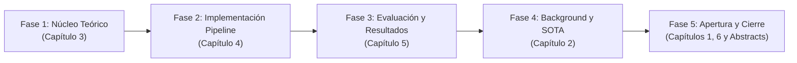

# Master Thesis Writing Roadmap: LLM-Assisted Risk-Adaptive Neurosymbolic Intent Planning

Este documento establece la estrategia maestra y el orden de redacción para la tesis de maestría:
**"LLM-Assisted Risk-Adaptive Decision Gates for Intent Based Optical Networks: A Pre-Deployment Decision Mechanism with Joint Semantic and QoT Assessment"**.

Escribir una tesis de ingeniería de posgrado sigue una **estrategia concéntrica (de adentro hacia afuera)**: se redacta primero el núcleo teórico y matemático (Capítulo 3) y la ingeniería del pipeline (Capítulo 4), se continúa con la validación experimental y métricas (Capítulo 5), se fundamenta con el Estado del Arte (Capítulo 2) y se concluye con el marco narrativo exterior (Capítulos 1 y 6, y finalmente el Abstract).

---

## 1. Cronograma y Orden de Ejecución por Fases

```mermaid
flowchart LR
    Phase1["Fase 1: Núcleo Teórico<br/>(Capítulo 3)"] --> Phase2["Fase 2: Implementación Pipeline<br/>(Capítulo 4)"]
    Phase2 --> Phase3["Fase 3: Evaluación y Resultados<br/>(Capítulo 5)"]
    Phase3 --> Phase4["Fase 4: Background y SOTA<br/>(Capítulo 2)"]
    Phase4 --> Phase5["Fase 5: Apertura y Cierre<br/>(Capítulos 1, 6 y Abstracts)"]
```

| Fase | Capítulo | Nombre | Dependencias Previas | Estado |
| :--- | :--- | :--- | :--- | :--- |
| **Fase 1** | **Capítulo 3** | System Model and Neurosymbolic Architecture | `Architecture_v5`, `ProblemStatement_v5` | **Capítulo Completado y Consolidado** (`3_SystemModel/chapter_3_system_model.txt`) |
| **Fase 2** | **Capítulo 4** | Neurosymbolic Pipeline Implementation | `src/core/`, `src/nodes/`, `src/services/` | **Capítulo Completado y Consolidado** (`4_NPImp/chapter_4_implementation.txt`) |
| **Fase 3** | **Capítulo 5** | Experimental Evaluation and Results | 3 baselines, 3 LLM backends, Nobel-Germany 17-node, Four Pillars | **Capítulo Completado y Consolidado** (`5_Evaluation/chapter_5_experimental_evaluation.txt`) |
| **Fase 4** | **Capítulo 2** | Background and State of the Art | `literature/`, SOTA papers (Confucius, AutoLight, PoliMi CNSM'25) | Pendiente |
| **Fase 5** | **Capítulo 1 & 6** | Introduction, Conclusion, and Abstracts | Toda la tesis completada | Pendiente final |

---

## 2. Mapeo Detallado de Capítulos, Subsecciones y Recomendaciones

---

### FASE 1: Capítulo 3 — System Model and Neurosymbolic Architecture

*Objetivo:* Formalizar matemáticamente el problema de enrutamiento óptico dirigido por intención, aislando el cálculo físico de la traducción lingüística y definiendo la compuerta de decisión adaptativa (RADG).

*Archivo Consolidado Overleaf:* `docs/LLM_Wiki/wiki/thesis_drafts/3_SystemModel/chapter_3_system_model.txt`

#### 3.1 Formal Problem Definition
- **3.1.1 System Inputs:** Intención en lenguaje natural no estructurada $\mathcal{I}_{NL} = (s, d, \mathcal{C}_{req})$, grafo topológico $G(V,E)$ y espacio de parámetros físicos $\mathbf{P} = \{\mathbf{p}(e_{ij}) \mid e_{ij} \in E\}$ con tuplas de atributos $\mathbf{p}(e_{ij}) = (L_{ij}, \alpha_{ij}, D_{ij}, \gamma_{ij}, \mathcal{A}_{ij})$ (con Remark de fibra homogénea SMF-28), y umbral de factibilidad física $\text{GSNR}_{th} = \text{SNR}_{min} + \text{Margin}_{design}$.
- **3.1.2 Resource Constraints:** Cota de tokens de contexto $T_{prompt}(\mathcal{I}_{NL}, G_{sub}) \le T_{max} \ll T_{full}(G)$ mediante extracción de subtopología de $k$-hops, cota de latencia de inferencia $t_{exec} = t_{LLM} + t_{solver} + t_{QoT} \le t_{max\_budget}$, y cota de cardinalidad de rutas candidatas $\mathcal{K}_{path} = \{\pi_1, \dots, \pi_K\}$ ($K \in [3, 5]$).
- **3.1.3 Physical and Semantic Boundary Constraints:** Factibilidad física determinista $\text{QoT}_{valid}(\pi) = \mathbb{I}(\text{GSNR}(\pi, \mathbf{P}) \ge \text{GSNR}_{th} \land P_{rx}(\pi) \ge P_{rx, min}) = 1$ (Remark sobre pérdida nula de ecualización en nodos ROADM filtrados) y cota de ambigüedad semántica $U_{sem} \le \tau_{sem}$.
- **3.1.4 Decision Variables and Operational Action Space:** Especificación simbólica $\mathcal{S}_{PDDL} = \mathcal{M}_{trans}(\mathcal{I}_{NL}, G_{sub})$, lightpath óptimo $\pi^* \in \mathcal{K}_{path}$, y espacio de acciones pre-despliegue $\mathcal{A} = \{\text{approve}, \text{clarify}, \text{replan}\}$.
- **3.1.5 The Global Optimization Objective:** Formulación bi-objetivo minimizando fricción operativa y tokens sujeto a compuertas duras pre-despliegue:
  $$\min_{\mathcal{S}_{PDDL}, \pi^*} \mathcal{J} = w_1 \cdot N_{hitl}(\mathcal{I}_{NL}) + w_2 \cdot T_{tokens}(\mathcal{I}_{NL}) \quad \text{s.t.} \quad D(U_{sem}, \text{QoT}_{valid}(\pi^*)) = \text{approve}, \quad \pi^* \in \mathcal{K}_{path}$$

#### 3.2 Proposed Neurosymbolic Framework
- **3.2.1 The Fail-Fast Pre-Deployment Architecture:** Contraste del paradigma *fail-fast pre-deployment* (validar certeza semántica antes de simulación física) frente a reintentos reactivos post-despliegue.
- **3.2.2 End-to-End Pipeline Overview:** Recorrido detallado de las 7 fases interconectadas entre el dominio lingüístico (Fases 1–3), físico determinista (Fases 4–6) y síntesis (Fase 7).
  - *Figura 3.1:* `conceptual_framework.pdf` (`Figure~\ref{fig:conceptual_framework}`) ilustrando Gate 1 ($U_{sem}$), Gate 2 ($\text{QoT}_{valid}$) y trayectorias de retroalimentación cerrada.
- **3.2.3 State Representation and Transaction Lifecycle:** Tupla de estado append-only $\mathcal{S}_{state} = \langle \mathcal{I}_{enriched}, G_{sub}, \mathcal{S}_{PDDL}, U_{sem}, \mathcal{K}_{path}, \mathbf{\Gamma}_{QoT}, \mathcal{D}_{action}, \mathcal{H}_{trace}, \mathcal{H}_{refine}, \kappa_{refine} \rangle$, reglas deterministas de transición y cota estricta de iteraciones ($\kappa_{refine} \le N_{max} = 3$).

#### 3.3 Strict Neurosymbolic Separation
- **3.3.1 Functional Delegation in Network Configuration:** Eliminación de alucinación física restringiendo el LLM a traducción semántica y delegando enrutamiento y QoT a algoritmos simbólicos.
- **3.3.2 PDDL Domain Formalization for Optical Routing:** Especificación formal del dominio óptico:
  - *Listing 3.1:* Jerarquía de tipos (`node`, `roadm`, `transponder`, `link`).
  - *Listing 3.2:* Definición de predicados (`connected`, `route`, `avoid-node`, `avoid-link`, `max-hops`, `min-gsnr`).
  - *Listing 3.3:* Ejemplo de especificación de metas PDDL.
- **3.3.3 Context-Free Grammar Structural Validation:** Reglas de producción S-expression $\mathcal{R}_{pddl}$ (Formal Specification 3.1) que evalúan $v_{struct} \in \{0, 1\}$. Si $v_{struct} = 0$, se fuerza inmediatamente $U_{sem} = 1.0$.
- **3.3.4 Deterministic Symbolic Solver and Graph Traversal:** Poda topológica de vértices ($\widetilde{V}_{sub}$), poda de aristas ($\widetilde{E}_{sub}$), algoritmo de Yen ($K=5$) y aplicación de cota de saltos ($|\pi| \le h_{max}$).

#### 3.4 The Risk-Adaptive Decision Gates
- **3.4.1 Mathematical Formulation of the RADG Decision Function:** Función por tramos $D(U_{sem}, \text{QoT}_{valid})$ mapeando a $\mathcal{A} = \{\text{approve}, \text{clarify}, \text{replan}\}$ con umbral calibrado $\tau_{sem} = 0.30$. Desacoplamiento jerárquico en software (Fase 3 Gate 1 vs Fase 6 Gate 2).
  - *Figura 3.2:* `radg_decision_space.pdf` (`Figure~\ref{fig:radg_decision_space}`) mapeando Zona I (Auto-Approve), Zona II (Suggest Replan) y Zona III (Early HITL Clarify) en el espacio $U_{sem}$ vs $\Delta\text{GSNR}$.
- **3.4.2 Two-Layer Semantic Uncertainty Quantification:** Capa 1 validez CFG ($v_{struct}$) + Capa 2 divergencia semántica de Reverse Prompting ($d_{sem}$ evaluada por LLM-judge), agregadas en $U_{sem} = 1.0$ si $v_{struct}=0$ else $d_{sem}$.
- **3.4.3 Deterministic Physical-Layer QoT Evaluation:** Modelo analítico Gaussian Noise (GN) para fibra no compensada:
  - Ruido ASE: $P_{ASE,m} = (G_m - 1) h \nu R_s NF_m$, $\text{OSNR}_{ASE}^{-1}(e_{ij})$.
  - Distorsión no lineal NLI: $\eta_0$, $P_{NLI,m} = \eta_0 L_{eff}^2 P_{ch}^3$, $\text{SNR}_{NLI}^{-1}(e_{ij})$.
  - Acumulación de GSNR: $\text{GSNR}(\pi)^{-1} = \text{SNR}_{tx,lin}^{-1} + \sum (\text{OSNR}_{ASE}^{-1} + \text{SNR}_{NLI}^{-1})$ con piso de transponder $\text{SNR}_{trx,dB} = 26.0\text{ dB}$, y $\text{GSNR}_{dB}(\pi)$.
  - Asignación de potencia y estrategia de lanzamiento (perfil estático de referencia).
  - Indicador binario de factibilidad física $\text{QoT}_{valid} \in \{0, 1\}$.
- **3.4.4 Proportional Human-in-the-Loop Re-Entry:** Puntos de interrupción desacoplados: Interrupción Semántica en Fase 3b ($U_{sem} > \tau_{sem}$) vs Interrupción Física en Fase 6 ($\text{QoT}_{valid} = 0$) con sugerencias de relajación basadas en telemetría.
- **3.4.5 Constraint Preservation and Convergence Guarantees:** Ecuación monótona de preservación $\mathcal{C}_{k+1} = \mathcal{C}_k \cup \text{Extract} \setminus \text{Revocations}$ y cota estricta $N_{max} = 3$ para prevenir bloqueos en plano de control.

---

### FASE 2: Capítulo 4 — Neurosymbolic Pipeline Implementation

*Objetivo:* Documentar la arquitectura de software real en `src/`, explicando cómo el diseño matemático del Capítulo 3 se traduce a código ejecutable en Python, LangGraph y servicios de red.

*Archivo Consolidado Overleaf:* `docs/LLM_Wiki/wiki/thesis_drafts/4_NPImp/chapter_4_implementation.txt`

#### 4.1 Orchestration and Pipeline Architecture
- **4.1.1 LangGraph State Machine Architecture and State Schema:** Máquina de estados dirigida acíclica que implementa el pipeline de 7 fases, aristas de enrutamiento condicional en Gate 1 (Fase 3) y Gate 2 (Fase 6), y suspensión asíncrona mediante `interrupt()`.
  - *Listing 4.1:* Master Orchestration State Schema (`AgentState` TypedDict).
  - *State Persistence and Checkpointing:* Snapshots serializados a nivel de thread para pausar/reanudar sin bloqueo de hilos.
- **4.1.2 Pipeline-to-Node Execution Mapping:** Mapeo 1:1 de las Fases 1 a 7 a funciones de nodo decoradas en Python (`intent_ingest_node`, `pddl_parser_node`, `semantic_gate_node`, `symbolic_solver_node`, `qot_validation_node`, `radg_node`, `plan_synthesizer_node`).

#### 4.2 Network Context and Subtopology Extraction
- **4.2.1 Optical Network Abstraction and Physical Testbed Modeling:** Abstracción en grafo $G(V,E)$ modelando ROADMs (`NetworkNode`) y líneas físicas (`FiberLink`, `Amplifier`).
  - *Listing 4.2:* Optical Network Domain Models (`Amplifier` y `FiberLink` con longitudes, ganancias/figuras de ruido EDFA, canales activos y pérdidas de puerto).
  - *Topología de Evaluación:* Topología nacional Nobel-Germany de SNDlib (17 nodos, 26 enlaces bidireccionales, tramos de 37.5\,km a 381.9\,km).
- **4.2.2 Scoped Subtopology Extraction via Mock GraphRAG:** Mitigación de saturación de tokens RESTConf/YANG mediante extracción de vecindario de $k$-hops $V_{sub} = \mathcal{N}_k(s) \cup \mathcal{N}_k(d)$ ($k=2$). Bounding estricto de prompt $T_{prompt} \ll T_{full}(G)$ que elimina la pérdida de atención.

#### 4.3 The Semantic Engine
- **4.3.1 Natural Language Intent Ingestion and Structured Extraction:** Inyección dinámica de subtopología y extracción de esquema estructurado con Pydantic.
  - *Prevención de Abstracción Numérica con Pérdida:* Preservación verbatim de la intención del operador en `active_intent` para evitar divergencia artificial.
- **4.3.2 Multi-Turn Intent Reconciliation and Disambiguation:** Modelo de clasificación estructurada para eliminar la fuga de restricciones fantasma (*ghost constraint leakage*):
  - *Listing 4.3:* Intent Reconciliation Resolution Schema (`FULL_REPLACEMENT` vs `PARTIAL_UPDATE`). Re-scoping topológico dinámico en GraphRAG si cambian los endpoints.
- **4.3.3 Context-Free Grammar (CFG) AST PDDL Validation:** Parser determinista de dos etapas para S-expressions: Tokenización con control de anidamiento y Constructor Recursivo de AST validando tipos y aridad contra $\mathcal{R}_{pddl}$ ($v_{struct} \in \{0, 1\}$).
- **4.3.4 Automated Reverse Prompting and Semantic Agreement Scoring:** Ejecución cerrada de Fase 3a sin intervención humana.
  - *Reconstrucción PDDL-a-NL:* Filtrado de prompt eliminando artefactos topológicos antes de la reconstrucción.
  - *Evaluación de Concordancia Semántica:* LLM Agreement Judge independiente que calcula divergencia $d_{sem}$.
- **4.3.5 Semantic RADG Execution:** Multiplexor de decisión de Gate 1 que evalúa $U_{sem}$: Branch A Paso Autónomo ($U_{sem} \le \tau_{sem}$) vs Branch B Interrupción Fail-Fast ($U_{sem} > \tau_{sem}$) disparando `interrupt()` en Fase 3b.

#### 4.4 The Physical Engine and Feasibility Validation
- **4.4.1 The Deterministic Symbolic Solver:** Algoritmo Yen's $K$-Shortest Paths no neural sobre el subgrafo podado $\widetilde{G}_{sub}$, aplicando exclusión de nodos/enlaces y cotas de saltos antes del cálculo físico.
- **4.4.2 GN-Model Quality of Transmission Engine:** Implementación analítica en Python del modelo Gaussian Noise:
  - *Listing 4.4:* Funciones analíticas de cálculo GN (`span_snr` por span amplificado y `calculate_demand_snr` sobre links en cascada con acumulación de ASE y NLI).
- **4.4.3 Physical RADG Execution Mechanics:** Evaluación de Gate 2: Branch A Aprobación ($\text{QoT}_{valid} = 1$) hacia Fase 7 vs Branch B Replan ($\text{QoT}_{valid} = 0$) suspendiendo en `interrupt()` de Fase 6 con telemetría para relajación de parámetros.
- **4.4.4 Proportional Human-in-the-Loop Engagement and Re-Entry Protocols:** Checkpoints desacoplados Fase 3b vs Fase 6, mecanismo de anulación rápida (*fast-track manual override*), cota de seguridad $N_{max} = 3$ y preservación de restricciones.

#### 4.5 Plan Synthesis and Verification
- **4.5.1 Plan Synthesis and Auditable Provisioning Trace:** Síntesis de rutas verificadas, telemetría física y métricas de decisión RADG en un Planning Report auditable.
  - *Listing 4.5:* Estructura del Planning Report sintetizado (esquema JSON).
- **4.5.2 Verification of the Seven Execution Paths:** Suite de verificación validando los 7 caminos operacionales canónicos: (1) Happy Path de pase único, (2) Loop de clarificación semántica, (3) Anulación manual fast-track, (4) Loop de replan físico, (5) Restricciones topológicas complejas, (6) Casos de borde topológico y partición, (7) Persistencia multi-interrupción.

---

### FASE 3: Capítulo 5 — Experimental Evaluation and Results

*Objetivo:* Evaluar cuantitativamente la hipótesis de la tesis utilizando tres baselines (Proposed RADG, Always-On HITL, LLM-Only) sobre tres LLM backends (Qwen 2.5 3B, GPT-6 Luna, GPT-5 Nano) evaluados completamente sobre el corpus de 120 demandas, demostrando que el RADG pre-despliegue intercepta configuraciones infeasibles mientras minimiza la fricción operativa del operador.

*Archivo Consolidado Overleaf:* `docs/LLM_Wiki/wiki/thesis_drafts/5_Evaluation/chapter_5_experimental_evaluation.txt`

#### 5.1 Experimental Setup
- **5.1.1 Network Topology and Physical Parameters:** Topología Nobel-Germany de 17 nodos y 26 enlaces (SNDlib, tramos de 37.5\,km a 381.9\,km), fibra SMF-28, modelos polinomiales de ganancia/ruido EDFA, piso de transponder back-to-back de 26\,dB, umbrales GSNR por modulación (100G QPSK 8.6\,dB, 200G 16-QAM 15.2\,dB) y sensibilidad de recepción $P_{rx} \in [-18.0, -8.0]$\,dBm.
  - *Figura 5.1:* `17_node_german.png` (`Figure~\ref{fig:17-node-german}`).
- **5.1.2 LLMs Under Evaluation:** Tres backends evaluados sobre el corpus completo de 120 demandas: Qwen 2.5 3B (local SLM en GPU de 4\,GB VRAM), GPT-6 Luna (cloud SOTA en razonamiento), GPT-5 Nano (cloud de alto throughput).
- **5.1.3 Benchmark Corpus and Diurnal Risk Classes:** Modelo de turno operativo diurno de 24 horas con 120 demandas divididas simétricamente en 4 clases de riesgo (30 demandas cada una): Clase I (Nominal), Clase II (Ambiguous), Clase III (Physically Infeasible), Clase IV (Adversarial).
- **5.1.4 Baseline Architectures:** Proposed RADG (compuertas duales pre-despliegue), Always-On HITL (revisión humana obligatoria en todo tráfico), LLM-Only (sin compuertas, inyección de errores RFC 8040 RESTCONF y reintentos reactivos).
- **5.1.5 Performance Metrics: The Four Validation Pillars:**
  - Pilar 1 (Semantic Translation): Constraint Retention Rate ($\text{CRR}$), CFG Pass Rate ($\text{CFG-PR}$), Semantic Agreement ($1 - d_{sem}$).
  - Pilar 2 (Physical Feasibility & Transmission Integrity): False Positive Rate ($\text{FPR}$, meta $0.0\%$), Physical Infeasibility Interception Rate ($\text{PIIR}$).
  - Pilar 3 (Efficiency & Operator Friction): Latencia End-to-End ($T_{E2E}$, mediana y media), Token Footprint ($T_{tokens}$, mediana y media), Media de Intervenciones HITL ($\bar{N}_{hitl}$), Task Completion Rate ($\text{TCR}$).
  - Pilar 4 (Gate Reliability & Autonomy): Gate Decision Accuracy ($\text{GDA}$, meta $\ge 95\%$), Selective HITL Precision.

#### 5.2 Intra-Model Comparative Analysis
- *Modelo representativo:* GPT-6 Luna sobre el corpus completo de 120 demandas.
- **5.2.1 The Alert Fatigue Dilemma: Why Always-On HITL Fails:** 30 interrupciones innecesarias en tráfico nominal (116 vs 86 totales), degradación de Selective HITL Precision de 100.0\% a 74.1\%, inflación de tokens de 15.0\% (+139k tokens) y penalización de latencia de +17.2\%.
  - *Tabla 5.1:* Comparativa de fricción de operador y cómputo en GPT-6 Luna.
  - *Figura 5.2:* `comparative_scalability_projection.pdf` (`Figure~\ref{fig:scalability_projection_luna}`) modelando la trayectoria de intervenciones acumuladas ($N_{hitl}$), mostrando 30 intervenciones evitadas y 25.9\% de reducción de fatiga.
- **5.2.2 The Post-Deployment Error Dilemma: Why LLM-Only Fails:** El reenvío ciego de 120 demandas al controlador produce 90 incidentes en el plano de control, $\text{FPR} = 100.0\%$, $\text{GDA} = 25.0\%$ y $\text{PIIR} = 0.0\%$. Los reintentos reactivos con payloads RFC 8040 disparan la mediana de tokens en un 72.9\% (9,200 a 15,908 tok) y la mediana de latencia en un 85.8\% (15.89\,s a 29.52\,s).
  - *Tabla 5.2:* Impacto en integridad de transmisión y cómputo de LLM-Only.
  - *Figura 5.3:* `comparative_deployment_flow_sankey.pdf` (`Figure~\ref{fig:comparative_deployment_flow_sankey}`) diagrama Sankey en 3 etapas contrastando 72\% de intercepción pre-despliegue en RADG (con bifurcación honesta de 4 fugas) vs 90 fallos en controlador en LLM-Only.
- **5.2.3 Computational Efficiency: Latency Distribution and Token Footprint:**
  - *Figura 5.4:* `comparative_efficiency_pillars.pdf` (`Figure~\ref{fig:comparative_efficiency_pillars}`) boxplots de latencia por clase y desglose de tokens útiles vs desperdiciados (Always-On desperdicia 54.0\% en nominales; LLM-Only desperdicia 41.5\%–44.1\% en recuperación reactiva).
- **5.2.4 The RADG Synthesis: Resolving Operational Tradeoffs:** Demostración de optimalidad de Pareto: 100.0\% autonomía nominal, 96.7\% GDA, 90.0\% PIIR y FPR confinado al 4.4\%.
  - *Tabla 5.3:* Resumen Ejecutivo de los Cuatro Pilares en GPT-6 Luna.

#### 5.3 Cross-Model Sensitivity Analysis
- *Evaluación cross-model:* Qwen 2.5 3B, GPT-6 Luna y GPT-5 Nano sobre 120 demandas cada uno.
- **5.3.1 Gate Decision Accuracy and Risk Interception Across LLM Backends:**
  - *Figura 5.5:* `cross_model_gate_accuracy.pdf` (`Figure~\ref{fig:cross_model_gate_accuracy}`) distribución apilada de acciones iniciales por clase y comparación Cleveland lollipop de GDA y FPR contra la meta del 95\%.
  - Desglose: Qwen 96.7\% GDA / 1.1\% FPR; Luna 96.7\% GDA / 4.4\% FPR; Nano 88.3\% GDA / 10.0\% FPR.
  - *Tabla 5.4:* Comparativa de métricas de decisión e integridad entre modelos.
- **5.3.2 The Model-Agnostic Physical Integrity Invariant and Semantic Sensitivity:** Descomposición en un piso determinista de integridad física invariable e independiente del modelo ($\text{PIIR} \ge 83.3\%$) y una frontera semántica sensible a la capacidad del LLM (que rige el FPR). Qwen demuestra un comportamiento altamente conservador (FPR = 1.1\%).
- **5.3.3 Efficiency Variability: Latency and Token Footprint Across Backends:**
  - *Tabla 5.5:* Eficiencia computacional entre backends.
  - Estabilidad arquitectural del consumo de tokens (~8.7k–9.2k mediana). Dinámica local vs nube: Qwen logra la menor mediana de latencia (13.19\,s) pero sufre colas en demandas adversariales complejas (media 25.76\,s, 2 timeouts) frente al 100\% de finalización en nube.

#### 5.4 Discussion and Limitations
- **5.4.1 On the False Positive Rate and Architectural Levers:** Invarianza física (cero violaciones de reach Clase III sin interceptar) y calibración del umbral semántico $\tau_{sem}$ (reducción de 0.30 a 0.15 para forzar $\text{FPR} \to 0.0\%$).
- **5.4.2 Corpus Scope and Topology Generalization:** Alcance de 120 demandas y escalabilidad de red nacional (17 nodos) a redes continentales o transoceánicas.
- **5.4.3 Threats to Validity:** Validez interna (respuestas HITL programáticas), externa (3 LLMs específicos, formulación GN) y de constructo (ponderación uniforme de FPR).

#### 5.5 Summary of Findings
- *Tabla 5.6:* Matriz consolidada de los Cuatro Pilares ($3\text{ modelos} \times 3\text{ baselines} \times 4\text{ pilares}$, 120 demandas).
- Tres conclusiones arquitecturales principales: (1) La compuerta pre-despliegue previene el colapso del controlador, (2) La compuerta selectiva adaptativa elimina la fatiga de alertas del operador, (3) La integridad física de transmisión es una propiedad invariante del sistema.
- Transición y puente al Capítulo 6.
- **Archivo Consolidado Overleaf:** `docs/LLM_Wiki/wiki/thesis_drafts/5_Evaluation/chapter_5_experimental_evaluation.txt`

---

### FASE 4: Capítulo 2 — Background and State of the Art

*Objetivo:* Posicionar la tesis dentro de la literatura académica reciente (2024–2026), justificando por qué el enfoque neurosimbólico pre-deployment cubre una brecha no resuelta.

#### 2.1 Agentic AI and Multi-Agent Systems in Intent-Driven Networks
- **Contenido:** Evolución de LLMs monolíticos a sistemas multi-agente en telecomunicaciones. Análisis de *Confucius* (Meta, SIGCOMM 2025), *AutoLight* (SJTU, ECOC 2025) y tutoriales de redes ópticas autónomas (JOCN 2026).
- **Recomendaciones:** Destacar que Confucius no maneja capa física óptica, y AutoLight utiliza secuencias de tareas estructuradas sin refinamiento conversacional con HITL.

#### 2.2 Physical-Layer Constraints and QoT Estimation in Optical Planning
- **Contenido:** Fundamentos del modelo GN, acumulaciones de ruido ASE y NLI, márgenes de diseño en redes elásticas (EON). Incapacidad intrínseca de los LLMs para realizar cálculos analíticos de capa física (*Hallucinated Physics*).
- **Referencias:** `[SOTA] GNPy_as_a_benchmark...pdf`, `[SOTA] Scientific_Knowledge-driven_Decoding_Constraints...pdf`.

#### 2.3 Intent Verification, Service Assurance, and Deployment Correction Strategies
- **Contenido:** Comparativa crítica de paradigmas de aseguramiento de servicio:
  - Verificación formal y gramáticas (GBNF, PDDL, AICCSA 2025).
  - Estrategias de reintento post-despliegue (PoliMi/CNSM 2025: El Hachimi et al.).
  - Abstracción de herramientas de dominio (Chalmers T-API ReAct, 2026).
- **Recomendaciones:** Argumentar detalladamente por qué el reintento post-despliegue es ineficiente y riesgoso en backbones ópticos frente a un gate pre-despliegue.

#### 2.4 The Research Gap: Pre-Deployment Risk-Adaptive Decision Gates and HITL Optimization
- **Contenido:** La matriz de brechas de la literatura ([[literature/sota_gap_analysis]]). Demostración de que ningún trabajo previo combina $U_{sem}$ + $\text{QoT}_{valid}$ en una compuerta pre-despliegue secuencial para optimizar las intervenciones del operador (HITL).

---

### FASE 5: Capítulo 1, Capítulo 6 y Abstracts

*Objetivo:* Enmarcar la contribución global con la perspectiva de la tesis completa.

#### 1.1 Overview and Motivation
- **Contenido:** Transición hacia redes autónomas L4, explosión del tráfico, complejidad de la capa física, riesgos de la IA generativa.

#### 1.2 Proposed Solution and Contributions
- **Contenido:** Resumen de las 4 contribuciones maestras: (1) Arquitectura Neurosimbólica estricta, (2) Compuerta RADG de decisión secuencial, (3) Protocolo Reverse Prompting con `interrupt()`, (4) Evaluación cuantitativa en topología Nobel-Germany.

#### 1.3 Thesis Structure
- **Contenido:** Guía de lectura de los capítulos 2 a 6.

#### 6.1 Summary of Contributions & 6.2 Future Work
- **Contenido:** Conclusiones, lecciones aprendidas y trabajo futuro (extensión a scheduling conjunto de cómputo y redes, integración con controladores T-API en producción).

#### Abstract & Abstract in lingua italiana (Sommario)
- **Contenido:** Resumen ejecutivo de 300 palabras estructurado en: Problema $\to$ Limitaciones de SOTA $\to$ Solución Propuesta (RADG) $\to$ Resultados Principales.

---

## 3. Normas de Estilo, Legibilidad y Control Antidetección AI

1. **Idioma de Redacción:** Inglés académico riguroso (American English o British English consistente; se recomienda American English estándar para IEEE/ACM).
2. **Índice de Legibilidad Flesch Reading Ease:** Objetivo entre **35.0 y 55.0** (Flesch-Kincaid Grade Level 12–15). Denso, preciso, formal, con oraciones equilibradas (18–25 palabras promedio), evitando estructuras laberínticas innecesarias.
3. **Formulación Matemática:** Uso exclusivo de LaTeX para todas las variables, vectores, conjuntos y ecuaciones numeradas.
4. **Lista Negra de Clichés de IA (PROHIBIDOS):**
   - *Prohibido:* "In conclusion", "delve into", "tapestry", "testament to", "crucial role", "vital role", "seamlessly", "furthermore/moreover" repetitivos, "it is worth noting that", "beacon of hope", "fosters", "pivotal".
   - *Estilo Preferido:* Frases asertivas en voz activa o pasiva técnica directa: *"The architecture evaluates..."*, *"Equation (3.4) defines..."*, *"To prevent optical non-linear saturation, the amplifier gain is bounded by..."*.