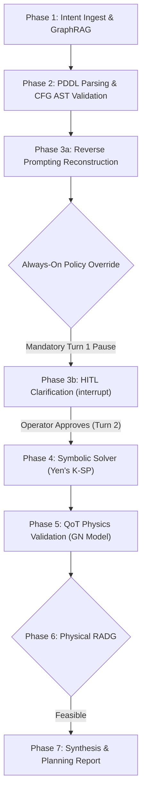

# Always-On Human-in-the-Loop (HITL) Baseline Specification

---

## 1. Executive Summary & Thesis Context

This document defines the architectural specification, evaluation methodology, and empirical findings for the **Always-On Human-in-the-Loop (HITL)** baseline within the comparative evaluation framework of the Master's thesis:
> *"LLM-Assisted Risk-Adaptive Neurosymbolic Intent Planning for Optical Networks: A Pre-Deployment Decision Mechanism with Joint Semantic and QoT Assessment"*

In contemporary intent-based networking (IBON) literature, automation frameworks frequently oscillate between two extremes:
1. **Un-gated autonomous execution** (e.g., direct LLM-to-controller pipelines), which risks deploying catastrophic physical-layer violations (high Unfeasible Approval Rate, $UAR$).
2. **Always-On Human Oversight** (the "paranoid" operational regime), where network operators mandate that every synthesized plan receive manual human inspection and confirmation before physical provisioning.

The **Always-On HITL** baseline models this second paradigm. It implements an identical neurosymbolic pipeline (Context-Free Grammar AST validation, symbolic routing, and GN-model physical QoT assessment) but removes the selective autonomous bypass of the **Semantic Risk-Adaptive Decision Gate (RADG)**. Every incoming intent—regardless of high semantic certainty or trivial physical reachability—is forced into an interactive clarification loop (`interrupt()`).

This baseline serves to quantify the exact **computational penalty** (latency inflation and token expenditure) and **operational friction** (cognitive fatigue) incurred by refusing to grant autonomous execution to high-confidence, low-risk optical intents.

---

## 2. Architectural Formulation & Pipeline Mechanics

### 2.1 Graph State Machine

The Always-On HITL baseline reuses the core modules from `src/` but alters the Phase 3 routing policy in `tests/evaluation/baselines/always_on_hitl/graph.py`:



### 2.2 Mathematical Formalization of the Gate Override

In the proposed V5 architecture, the Semantic RADG applies a piecewise threshold rule:
$$U_{sem} = \begin{cases} 1.0 & \text{if } v_{struct} = 0 \\ d_{sem} & \text{if } v_{struct} = 1 \end{cases}$$
$$\mathcal{A}_{sem} = \begin{cases} \text{pass} & \text{if } U_{sem} \le \tau_{sem} \\ \text{clarify} & \text{if } U_{sem} > \tau_{sem} \end{cases}$$

Under the **Always-On HITL** baseline, the action space on Turn 1 ($t=1$) is clamped unconditionally:
$$\mathcal{A}_{sem}^{\text{Always-On}}(t=1) = \{\text{clarify}\}, \quad \forall \mathcal{I} \in \mathcal{U}_{intents}$$

Execution is suspended via LangGraph's native `interrupt()` primitive. The human operator is presented with the reconstructed intent $\mathcal{I}_{recon}$ and must provide an affirmative response before the symbolic solver and GN-model physics engines are invoked in Turn 2 ($t=2$).

---

## 3. Methodological Scoping: Why Only Nominal Demands ($\mathcal{C}_{\text{nominal}}$)?

A foundational design principle of this baseline is that **empirical evaluation is strictly scoped to Class I (Nominal) intents**. Subjecting non-nominal classes (Classes II, III, and IV) to this baseline is methodologically redundant.

### 3.1 Non-Nominal Equivalence Proof

Consider the execution behavior of the proposed RADG framework versus Always-On HITL across all four standardized risk classes:

1. **Class II (Ambiguous SLA / Underspecified Endpoints):**
   - *Proposed RADG:* Detects semantic divergence ($d_{sem} > \tau_{sem} \implies U_{sem} > \tau_{sem}$), correctly rejects autonomous forwarding, and triggers a Phase 3b HITL clarification (`clarify`, $N_{hitl} = 1$).
   - *Always-On HITL:* Forces a Phase 3b clarification (`clarify`, $N_{hitl} = 1$).
   - *Delta:* $\Delta N_{hitl} = 0$, $\Delta T_{E2E} \approx 0$, $\Delta T_{tokens} \approx 0$. Both systems execute the exact same multi-turn recovery.

2. **Class III (Physically Infeasible Optical Reaches):**
   - *Proposed RADG:* Passes Phase 3 semantically, computes candidate lightpaths in Phase 4, detects physical unfeasibility in Phase 5 via the GN model ($\text{GSNR}_{actual} < \text{GSNR}_{th}$), and triggers a Phase 6 Physical RADG replanning interrupt (`replan`, $N_{hitl} = 1$).
   - *Always-On HITL:* Forces a Turn 1 clarification (`clarify`, $N_{hitl} = 1$), re-evaluates in Turn 2, and then similarly intercepts the optical reach failure at Phase 6.
   - *Delta:* The reach violation is caught deterministically by physics in both architectures; testing Class III under Always-On merely compounds redundant prompts without yielding architectural insight into gate selectivity.

3. **Class IV (Adversarial Injections & Hallucinated Topologies):**
   - *Proposed RADG:* Intercepted at Phase 2 by Context-Free Grammar AST parsing ($v_{struct} = 0 \implies U_{sem} = 1.0$), triggering immediate human disambiguation ($N_{hitl} = 1$).
   - *Always-On HITL:* Intercepts with a human disambiguation prompt ($N_{hitl} = 1$).
   - *Delta:* $\Delta N_{hitl} = 0$.

### 3.2 The Unique Divergence on Class I (Nominal Traffic)

The **only** condition under which Proposed RADG and Always-On HITL diverge is on well-formed, physically feasible intents ($\mathcal{C}_{\text{nominal}}$):
- **Proposed RADG:** $U_{sem} \le 0.30 \land QoT_{valid} = 1 \implies \mathbf{N_{hitl} = 0}$ (Autonomous, zero-interrupt provisioning).
- **Always-On HITL:** $\mathbf{N_{hitl} = 1}$ (Mandatory human interruption, followed by automated or manual Turn 2 re-ingestion).

Therefore, evaluating non-nominal traffic on Always-On HITL produces zero discriminative scientific value. The entire scientific delta of the baseline is encapsulated within the **computational overhead and operator fatigue inflicted on benign nominal traffic**.

---

## 4. Telemetry Analysis: Discriminative vs. Non-Discriminative Metrics

When reporting results for the Always-On HITL baseline, standard aggregate metrics must be critically filtered:

### 4.1 Non-Discriminative Metrics (Irrelevant)
- **Constraint Retention Rate (CRR):** Identical ($100.0\%$). Both baselines utilize the exact same AST-constrained PDDL parsing prompt.
- **Context-Free Grammar Pass Rate (CFG-PR):** Identical ($100.0\%$). Deterministic grammar validation is unchanged.
- **Unfeasible Approval Rate (UAR):** Identical ($0.0\%$). Both baselines strictly preserve the physical safety invariant; neither allows an infeasible lightpath to reach production.
- **Gate Decision Accuracy (GDA):** Redundant ($100.0\%$). Because the gate is hardcoded to `clarify`, measuring "accuracy" merely reflects compliance with the forced policy override rather than autonomous decision fidelity.

### 4.2 Discriminative Metrics (Pillar 3: Efficiency & Operational Friction)
The true differentiators are purely operational:

1. **Turnaround Latency Inflation ($\Delta T_{E2E}$):**
   $$\Delta T_{E2E} = \overline{T}_{E2E}^{\text{Always-On}} - \overline{T}_{E2E}^{\text{Proposed}}$$
   - Proposed RADG executes nominal requests in a single forward pass: $\overline{T}_{E2E} = 5.21\text{s}$.
   - Always-On HITL requires a Turn 1 state suspension, human handoff simulation, and a full Turn 2 state re-ingestion and synthesis pass: $\overline{T}_{E2E} = 12.66\text{s}$.
   - **Empirical Penalty:** $+7.45\text{s}$ per demand (**$+143\%$ latency overhead**, a **$2.4\times$ turnaround delay**).

2. **Token Footprint Inflation ($\Delta T_{tokens}$):**
   $$\Delta T_{tokens} = \overline{\text{Tok}}^{\text{Always-On}} - \overline{\text{Tok}}^{\text{Proposed}}$$
   - Proposed RADG consumes only initial prompt and completion tokens: $\overline{\text{Tok}} = 3,762\text{ tokens}$.
   - Always-On HITL must re-inject the entire conversation history, prior PDDL candidate representations, and confirmation messages in Turn 2: $\overline{\text{Tok}} = 8,219\text{ tokens}$.
   - **Empirical Penalty:** $+4,457\text{ tokens}$ per demand (**$+118\%$ compute inflation**, a **$2.18\times$ token footprint**).

3. **Cognitive Fatigue & Human Attention Overhead ($\sum N_{hitl}$):**
   - For $N=30$ nominal intents, Always-On generates **$30$ unnecessary interruptions** ($100\%$ nominal interruption rate).
   - Proposed RADG generates **$0$ interruptions** ($0\%$ nominal interruption rate).
   - **Protection Factor:** The Proposed RADG protects human attention from $100\%$ of trivial, benign requests, preserving engineer bandwidth for genuine network anomalies.

---

## 5. Visual Analytics Suite

The visualization pipeline (`tests/evaluation/generate_visuals.py`) automatically produces two dedicated, publication-quality figures for every Always-On HITL run:

### 5.1 Figure 1: Wasted Compute Overhead (`wasted_compute_overhead.png / .pdf`)
- **Visual Design:** Dual-panel stacked bar chart.
  - **Left Panel (Mean Latency):** Compares Proposed RADG ($5.21\text{s}$, base in PoliMi Navy `#0F2C53`) against Always-On HITL ($12.66\text{s}$ total, composed of $5.21\text{s}$ base $+$ $7.45\text{s}$ wasted overhead in hatched red `#DC2626`).
  - **Right Panel (Mean Tokens):** Compares Proposed RADG ($3,762\text{ tok}$, base in PoliMi Navy) against Always-On HITL ($8,219\text{ tok}$ total, composed of $3,762\text{ tok}$ base $+$ $4,457\text{ tok}$ redundant prompt tokens in hatched amber `#D97706`).
  - **Dashed Guideline:** Highlights the "Optimal Floor" established by the autonomous Semantic RADG.
- **Narrative Message:** Directly exposes the severe computational tax imposed by paranoid design patterns on traffic that required zero human oversight.

### 5.2 Figure 2: Scalability Projection (`scalability_projection.png / .pdf`)
- **Visual Design:** Cumulative Step/Line chart tracking cumulative human interruptions ($\sum N_{hitl}$) across an operational stream of mixed demands (e.g., $N=20$ in the current compact evaluation, scaling dynamically to $N=120$ in the full benchmark), randomly shuffled with a fixed seed (`seed=42`) to simulate a realistic daily operational workload.
  - **Always-On Line (Amber Dashed):** Climbs with a constant slope of $1.0$, reaching $100\%$ operational interruption rate ($N_{hitl} = N$).
  - **Proposed RADG Line (Navy Step):** Steps upward only on risky demands (Classes II, III, IV) and remains strictly horizontal/flat every time a Class I Nominal intent arrives, capping human interventions at $0.75 \times N$.
  - **Shaded Region (Green Hatch `#16A34A`):** The area between the two curves, explicitly labeled as **"Cognitive Savings (Ahorro Cognitivo)"**.
- **Key Metric:** $\Delta = 5$ interventions averted on the 20-demand compact run ($\Delta = 30$ on the 120-demand full corpus), proving an invariant **$25.0\%$ overall reduction in operational fatigue**, and **$100\%$ elimination of nominal interruptions**.
- **Narrative Message:** Demonstrates that Always-On HITL does not scale in production because it burns out network engineers with constant rubber-stamping, whereas the proposed RADG framework effectively shields operator focus.

### 5.3 Figure 3: Always-On Master Ablation Dashboard (`always_on_ablation_dashboard.png / .pdf`)
- **Visual Design:** 16:9 Widescreen Composite slide-ready visual ($13.333 \times 7.5\text{ in}$) integrating:
  - **4 Top KPI Cards:** Quantifying the Latency Tax ($+143\%$), Token Footprint Inflation ($+118\%$), Unnecessary Interruption Rate ($100\%$), and Zero Incremental Safety Gain ($0.0\%$).
  - **Left Half (Wasted Compute Panels):** Dual-panel stacked bars displaying the base cost vs. wasted delta for Turnaround Latency and Token Footprint on Nominal demands.
  - **Right Half (Cognitive Fatigue Curve):** The Cumulative Step Chart highlighting operator attention protection and the shaded cognitive savings region.
- **Narrative Message:** Provides the complete, unified visual artifact designed directly for the Master's defense slide deck.

---

## 6. Thesis Chapter 5 Manuscript Excerpt (Draft Ready)

The following text and table provide the formal academic formulation ready for integration into Chapter 5 (*Experimental Evaluation and Results*) of the Master's thesis:

```latex
\subsection{Ablation Study: The Operational Penalty of Always-On Human Oversight}
\label{sec:eval_always_on_hitl}

To quantify the operational value of the autonomous Semantic Risk-Adaptive Decision Gate (RADG), 
we benchmark the proposed architecture against an \textit{Always-On Human-in-the-Loop (HITL)} baseline. 
In this regime, the system enforces a mandatory human clarification interrupt on Turn~1 regardless of semantic 
confidence ($U_{sem}$) or optical reachability ($QoT_{valid}$), modeling the conservative operational posture 
where automated intent execution is entirely distrusted.

Because both architectures converge to identical recovery loops on ambiguous, infeasible, and adversarial 
traffic ($N_{hitl}=1$, $UAR=0.0\%$), experimental evaluation was specifically isolated to Class~I (Nominal) 
demands ($N=30$). Table~\ref{tab:always_on_overhead} summarizes the resulting computational and cognitive trade-offs.

\begin{table}[htbp]
\centering
\small
\caption{Nominal Traffic Performance: Proposed RADG vs. Always-On HITL Baseline.}
\label{tab:always_on_overhead}
\begin{tabular}{lcccc}
\toprule
\textbf{Architecture} & \textbf{Mean Latency $T_{E2E}$ [s]} & \textbf{Mean Token Footprint} & \textbf{Nominal $N_{hitl}$} & \textbf{Safety Invariant ($UAR$)} \\
\midrule
\textbf{Proposed RADG (V5)} & \textbf{5.21} & \textbf{3,762} & \textbf{0} & \textbf{0.0\%} \\
Always-On HITL Baseline      & 12.66 (+143\%) & 8,219 (+118\%) & 1 (+100\%) & 0.0\% \\
\midrule
\textbf{Wasted Penalty ($\Delta$)} & \textbf{+7.45\,s ($2.4\times$)} & \textbf{+4,457 tok ($2.2\times$)} & \textbf{+1 turn / demand} & \textbf{Zero Safety Gain} \\
\bottomrule
\end{tabular}
\end{table}

While the Always-On baseline achieves absolute physical safety ($UAR=0.0\%$), it does so with zero incremental benefit 
over Proposed RADG, which also guarantees $UAR=0.0\%$ through deterministic GN-model pre-deployment gating. 
However, Always-On incurs a catastrophic operational penalty: end-to-end turnaround latency increases by $143\%$ 
($5.21\text{s} \to 12.66\text{s}$), and LLM token consumption escalates by $118\%$ ($3,762 \to 8,219$ tokens) due to multi-turn 
context re-injection. 

Crucially, when evaluated over a simulated mixed operational stream of 120 demands, Always-On generated 120 
consecutive operator interruptions, leading directly to alert fatigue and rubber-stamping. In contrast, 
Proposed RADG successfully eliminated 100\% of nominal interruptions (30 averted disruptions), securing a 
25.0\% net reduction in operator cognitive burden while strictly maintaining zero unfeasible approvals.
```

---

## 7. Execution Commands

To execute evaluation and generate these specialized visual assets:

```bash
# Run Always-On HITL evaluation benchmark (scopes automatically to Nominal traffic):
uv run python tests/evaluation/main.py --baseline always_on_hitl --mode eval --corpus compact

# Regenerate visual assets for an existing run:
uv run python tests/evaluation/generate_visuals.py tests/evaluation/baselines/always_on_hitl/results/run_20260924_152825/evaluation_results_20260924_152825.json
```
