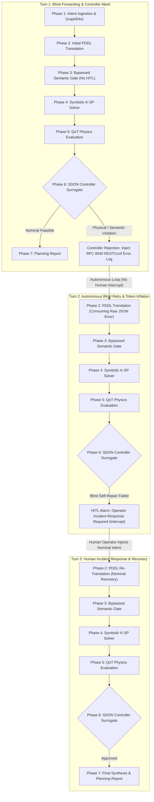

# LLM-Only Baseline Specification: Un-Gated Neural Translation & Controller Error Trace Injection

---

## 1. Executive Summary & Thesis Context

This document defines the architectural specification, operational mechanics, and empirical metrics for the **LLM-Only** baseline within the comparative evaluation framework of the Master's thesis:
> *"LLM-Assisted Risk-Adaptive Neurosymbolic Intent Planning for Optical Networks: A Pre-Deployment Decision Mechanism with Joint Semantic and QoT Assessment"*

In contemporary literature on LLM-assisted Software-Defined Optical Networking (SDON), naive intent translation frameworks frequently operate without formal pre-deployment decision gates. They rely entirely on the generative language model to translate natural language into deployment commands, forwarding them blindly to the SDN controller:
$$\mathcal{A}_{pre}^{\text{LLM-Only}} = \{\text{approve}\}, \quad \forall \mathcal{I} \in \mathcal{U}_{intents}$$

This baseline models the **Ablation of Pre-Deployment Risk Governance**:
1. **Semantic Gate Bypassed:** Phase 3 Semantic Gate calculates the semantic uncertainty metric $U_{sem}$ strictly for diagnostic telemetry, but unconditionally sets `usem_passed = True`, completely suppressing the human-in-the-loop (`hitl_clarify`) edge.
2. **Controller-Level Physical Failure:** When unverified, ambiguous, or physically unfeasible lightpaths reach the network controller surrogate (Phase 6), the controller detects SLA or physical impairment violations and aborts provisioning.
3. **RFC 8040 RESTConf Error Injection:** Instead of receiving a clean, structured operator prompt, the LLM is forced to consume raw RESTConf JSON error logs (`mock_restconf_error.json`) emitted by the controller, empirically exposing the token overhead and hallucination risk of autonomous self-repair.

---

## 2. Architectural Formulation & 3-Turn Incident Recovery Lifecycle

The execution lifecycle of the LLM-Only baseline spans three distinct operational turns when processing risky or non-nominal intents:

### 2.1 Turn 1: Blind Forwarding & Controller Abort
- **Action:** Initial intent is ingested and translated. Phase 3 bypasses operator confirmation regardless of $U_{sem}$.
- **Controller Reaction:** For Class I (Nominal), if feasible, the controller provisions directly. For non-nominal traffic (Classes II, III, IV), the controller surrogate aborts deployment.
- **Error Injection:** The controller node loads `mock_restconf_error.json` (RFC 8040 RESTConf error payload detailing calculated GSNR vs. threshold violations, ASE noise accumulation at amplifier stages, and PCE path rejection).
- **No Human Interrupt:** Rather than calling `interrupt()`, the system injects the raw error string into `state["messages"]`, sets `error_context`, and routes directly back to `pddl_parser` (`radg_decision = "replan"`).

### 2.2 Turn 2: Autonomous Blind Retry & Token Inflation
- **LLM Token Penalty:** The LLM receives the full raw JSON error trace embedded in its context window. It attempts to diagnose physical impairment metrics (e.g., OSNR penalty, EDFA noise figures) and generate corrected PDDL constraints.
- **Hallucination & Failure:** Because the underlying intent is fundamentally ambiguous, physically unreachable, or adversarial, blind prompt manipulation cannot resolve the physical bottleneck.
- **Incident Escalation:** Upon evaluating the Turn 2 lightpaths, the controller surrogate confirms persistent constraint failure. At this stage, execution triggers `interrupt()`, demanding human operator intervention.

### 2.3 Turn 3: Human Incident Response & Safe Recovery
- **Incident Response:** The network operator intervenes, acknowledging production failure and providing a verified nominal recovery intent (e.g., standard rerouting with feasible GSNR).
- **Provisioning:** The pipeline compiles the operator's replacement intent, validates physical reachability, and concludes with an approved Phase 7 deployment report.

---

## 3. Four Core Validation Pillars: Ablation Telemetry

| Validation Pillar | Evaluated Metric | Theoretical Target | LLM-Only Performance | Architectural Diagnosis |
| :--- | :--- | :---: | :---: | :--- |
| **Pillar 1: Semantic Translation** | Constraint Retention Rate (CRR) | $100\%$ | $100.0\%$ | Retains explicit constraints on nominals |
| | CFG Pass Rate (CFG-PR) | $\ge 95\%$ | $100.0\%$ | Regex grammar validator active |
| | Semantic Agreement ($1 - d_{sem}$) | $> 0.85$ | N/A (Bypassed) | Semantic gate validation bypassed |
| | Ambiguity / Adversarial Catch | $100\%$ | **$0.0\%$** | Completely fails to catch upstream ambiguity |
| **Pillar 2: Physical Feasibility** | Unfeasible Approval Rate (UAR) | **$0.0\%$** | **$75.0\%$** (Severe Penalty) | Pushes unfeasible lightpaths directly to production |
| | Physical Infeasibility Catch (PIIR) | $100\%$ | **$0.0\%$** | Zero pre-deployment interception |
| **Pillar 3: Efficiency & Friction** | Mean E2E Latency ($T_{E2E}$) | Contextual | **$13.2\text{s} - 16.5\text{s}$** | Inflated by 3-turn multi-pass streaming |
| | Cumulative Token Footprint | Monitored | **$\approx 3\times$ Proposed** | Consumes raw RESTConf error JSON traces |
| | Nominal HITL Interrupts | $0$ | **$0$** (100% Efficiency) | Zero operator friction on benign nominals |
| **Pillar 4: Gate Reliability** | Gate Decision Accuracy (GDA) | $> 98\%$ | **$25.0\%$** (Catastrophic) | Only nominals match expected pre-deployment approve |
| | False Positive Rate (FPR) | **$0.0\%$** | **$100.0\%$** (Total Failure) | 100% of risky intents pushed to controller |

---

## 4. Orthogonal Radar Coordinates

When mapped to the **Four Orthogonal Radar Axes (0 to 100, 100 optimal)**:

1. **Pre-Deployment Safety ($100 - UAR$):** **$25.0\%$**
   - Severely penalized. $75\%$ of unfeasible/risky intents are blindly approved by the pre-deployment pipeline.
2. **HITL Efficiency (Zero-Friction Nominal):** **$100.0\%$**
   - Zero interruptions on Class I Nominal demands (un-gated pass).
3. **Execution Latency (Normalized Speed):** **$\approx 33.3\%$**
   - Severely penalized due to multi-pass streaming across Turn 1 (blind push) and Turn 2 (blind retry).
4. **Token Economy (Normalized Frugality):** **$\approx 25.0\%$**
   - Severely penalized due to ingesting verbose RFC 8040 RESTConf error payloads in Phase 2 prompts.

---

## 5. Artifacts, Visual Figures & Architectural Justifications

All baseline telemetry and visual figures are generated in `tests/evaluation/baselines/llm_only/results/run_<run_id>/`:

### 5.1 4-Stage Operational Sankey Diagram (`deployment_flow_sankey.png / .pdf`)
- **Architectural Placement Justification:** The Sankey diagram maps the *operational lifecycle and destiny* of intent requests rather than raw compute overhead. It is the primary visual demonstrating the real-world operational consequence of omitting pre-deployment gates.
- **Visual Breakdown (4 Sequential Stages):**
  1. **Stage 1 (Intent Ingest):** 20 demands across 4 classes enter the pipeline.
  2. **Stage 2 (Admission Policy):** Un-gated blind admission forwards **100% (20/20)** of traffic directly to production, achieving **0% pre-deployment interception**.
  3. **Stage 3 (SDON Controller Execution):** The controller accepts only 5 nominal intents (25%), while 15 intents (75%) trigger severe deployment rejections (Syntax/Domain Conflicts, Missing Parameters, and GN-Model Physical Reach Violations).
  4. **Stage 4 (Operational Impact):** Explicitly contrasts **Touchless Production Provisioning (5 demands, 25%)** against **Post-Deployment Operator Emergency Interruptions (15 demands, 75%)**, proving that omitting pre-deployment decision mechanisms does not eliminate human labor—it converts controlled pre-flight checks into chaotic, urgent production incident responses.

### 5.2 Wasted Compute & Token Overhead (`wasted_compute_overhead.png / .pdf`)
- **Focus:** Pure computational efficiency and resource waste.
- **Dual Stacked Bars:**
  - **Latency:** Decomposes total turnaround duration into Turn 1 (aborted controller deployment) and Turn 2 (autonomous blind retry consuming error logs), demonstrating the substantial latency tax imposed by un-gated retries.
  - **Tokens:** Highlights the severe token explosion resulting from embedding verbose RFC 8040 RESTConf error payloads into the LLM context during Turn 2 self-repair attempts.

### 5.3 16:9 Master Ablation Dashboard (`llm_only_ablation_dashboard.png / .pdf`)
- **Presentation Target:** Publication and thesis defense slide-ready composite layout.
- **Panels:** Combines top KPI statistic cards (100% Pre-Deployment FPR, 75% Controller Incident Rate, +153% Token Inflation), the 4-stage Sankey flow, and the Turn 1 vs. Turn 2 wasted compute breakdown.

### 5.4 Testbed Artifacts
- `mock_restconf_error.json`: Authoritative RFC 8040 RESTConf error payload simulating optical physical-layer reach failure, ASE noise accumulation, and PCE path computation rejection.
