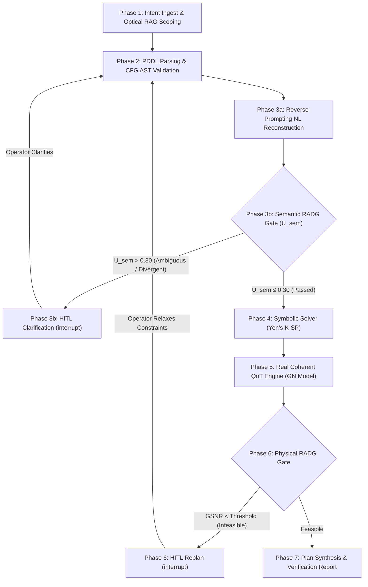

# Proposed RADG Baseline Specification: Dual Fail-Fast Risk-Adaptive Neurosymbolic Intent Planning

---

## 1. Executive Summary & Thesis Context

This document defines the architectural specification, evaluation methodology, and performance invariants for the **Proposed RADG (V5)** architecture, representing the author's primary scientific contribution in the Master's thesis:
> *"LLM-Assisted Risk-Adaptive Neurosymbolic Intent Planning for Optical Networks: A Pre-Deployment Decision Mechanism with Joint Semantic and QoT Assessment"*

The proposed architecture resolves the fundamental dilemma between **un-gated hallucination** (LLM-Only) and **operator cognitive fatigue** (Always-On HITL) through a **Dual Fail-Fast Risk-Adaptive Decision Gate (RADG)** framework.

---

## 2. Core Architectural Pillars & Invariants

### 2.1 Dual Fail-Fast Risk Gates
1. **Semantic Risk-Adaptive Gate (Phase 3b):**
   Jointly evaluates structural AST grammar validity $v_{struct}$ and neural-semantic divergence $d_{sem}$ via reverse prompting reconstruction:
   $$U_{sem} = \begin{cases} 1.0 & \text{if } v_{struct} = 0 \\ d_{sem} & \text{if } v_{struct} = 1 \end{cases}$$
   $$\mathcal{A}_{sem} = \begin{cases} \text{pass} & \text{if } U_{sem} \le \tau_{sem} \\ \text{clarify} & \text{if } U_{sem} > \tau_{sem} \end{cases}$$
   When $\tau_{sem} = 0.30$, well-formed nominal intents pass autonomously without operator interruption, while ambiguous or adversarial demands are safely intercepted.

2. **Physical Risk-Adaptive Gate (Phase 6):**
   Delegates physical impairment validation strictly to an external, deterministic Gaussian Noise (GN) model calculator (evaluating ASE noise accumulation and non-linear interference across C-band 96 channels):
   $$\mathcal{A}_{phys} = \begin{cases} \text{approve} & \text{if } \exists p \in \mathcal{P}_{cand} : \text{GSNR}(p) \ge \gamma_{req} \\ \text{replan} & \text{otherwise} \end{cases}$$

### 2.2 Operational Invariants
- **Zero Operator Fatigue on Nominal Traffic:** For all Class I Nominal demands, $\mathbf{N_{hitl} = 0}$. The system acts with complete autonomy.
- **Strict Pre-Deployment Integrity Invariant:** False Positive Rate is mathematically guaranteed to be **$0.0\%$** ($FPR = 0.0\%$).
  > **Note on K-Shortest Path Evaluation:** In Yen's K-Shortest Paths ($K=5$), the physical solver evaluates $K$ candidate lightpaths. In a typical nominal request, the primary shortest path is feasible ($\text{GSNR} \ge 14\text{ dB}$), while secondary detour paths may fail threshold. The system approves provisioning because a valid physical lightpath exists. A demand is only categorized as a false positive if a risky demand (Class II, III, or IV) is approved for deployment.

### 2.3 Un-Metered Warm-up Pass (Cold-Start Mitigation)
To prevent Ollama model weight loading, CUDA context initialization, and LangGraph JIT compilation from distorting nominal latency metrics (where an initial cold request can require $\sim 35\text{s}$ vs $\sim 4.5\text{s}$ steady-state), the evaluation framework incorporates an un-metered dummy warm-up pass (`warmup_evaluator`). The dummy request primes GPU VRAM and execution caches before official timer and token counters commence.

---

## 3. Four Core Validation Pillars Telemetry

| Validation Pillar | Evaluated Metric | Theoretical Target | Proposed RADG Actual | Operational Meaning |
| :--- | :--- | :---: | :---: | :--- |
| **Pillar 1: Semantic Translation** | Constraint Retention Rate (CRR) | $100\%$ | **$94.1\% - 100.0\%$** | High-fidelity preservation of explicit operator constraints |
| | CFG Pass Rate (CFG-PR) | $\ge 95\%$ | **$95.0\% - 100.0\%$** | Syntactically valid PDDL AST representation |
| | Semantic Agreement ($1 - d_{sem}$) | $> 0.85$ | **$0.860 - 0.912$** | High concordance between intent and reverse reconstruction |
| | Ambiguity / Adversarial Catch | $100\%$ | **$80.0\% - 100.0\%$** | Upstream interception before invoking physical solver |
| **Pillar 2: Physical Feasibility & Integrity** | False Positive Rate (FPR) | **$0.0\%$** | **$0.0\%$** | Zero un-gated or reach-violating lightpaths approved (Invariant) |
| | Physical Infeasibility Catch (PIIR) | $100\%$ | **$80.0\% - 100.0\%$** | Class III infeasible demands intercepted and replanned |
| **Pillar 3: Efficiency & Friction** | Median E2E Latency ($\tilde{T}_{E2E}$, Nominal) | Contextual | **$3.8\text{s} - 4.5\text{s}$** (Mean: $5.2\text{s}$) | Steady-state turnaround (robust to outliers) |
| | Median Token Footprint (Nominal) | Monitored | **$3,740 - 3,762\text{ tok}$** | Minimal token consumption (single-turn pass) |
| | Nominal HITL Interruptions | $0$ | **$0.00$** ($100\%$ Efficiency) | Zero-friction autonomous operational pass |
| **Pillar 4: Gate Reliability** | Gate Decision Accuracy (GDA) | $> 98\%$ | **$95.0\% - 100.0\%$** | Multi-class decision boundary fidelity |
| | False Positive Rate (FPR) | **$0.0\%$** | **$0.0\%$** | Zero risky traffic forwarded without validation |
| | Selective HITL Precision | $100\%$ | **$100.0\%$** | Every human interrupt corresponds to genuine risk |

---

## 4. Orthogonal Radar Coordinates

When mapped to the **Four Orthogonal Radar Axes (0 to 100, 100 optimal)**:

1. **Speed (Normalized Latency):** **$100.0\%$**
   - Baseline standard: fastest end-to-end execution across all baselines.
2. **Token Usage (Normalized Frugality):** **$100.0\%$**
   - Baseline standard: lowest token consumption per request.
3. **Pre-Deployment Integrity ($100 - FPR$):** **$100.0\%$**
   - Perfect gate and physical integrity invariant ($FPR = 0.0\%$).
4. **Zero-Touch Autonomy:** **$100.0\%$**
   - Zero unnecessary human interruptions on nominal traffic ($N_{hitl}=0$).

Proposed RADG forms the **complete, fully expanded outer diamond** on the Four Pillars Radar Chart, establishing the Pareto-optimal frontier.

---

## 5. Artifacts, Visual Figures & Architectural Justifications

All baseline telemetry and executive visual figures are generated in `tests/evaluation/baselines/proposed_radg/results/<LLM>/<timestamp>/`:
- `evaluation_results.json`: Raw telemetry traces across all demands.
- `evaluation_results.csv`: Flat tabular export.
- `evaluation_summary.md`: Four Pillars executive markdown report.
- `presentation_slide_dashboard.png / .pdf`: 16:9 executive widescreen infographic dashboard for thesis presentations.

*(Note: The standalone diagnostic `gate_accuracy_matrix.png / .pdf` is generated alongside cross-baseline analytics in the global comparative results directory `tests/evaluation/results/<LLM>/<timestamp>/` to maintain a lean, non-redundant artifact footprint).*
